# Infrastructure Architecture Documentation

## Related Documentation

This document provides complete technical architecture details. For related information:

- **Quick Overview:** [PRESENTATION.md](PRESENTATION.md) - 10-minute high-level presentation
- **Setup Instructions:** [SETUP-GUIDE.md](SETUP-GUIDE.md) - Step-by-step deployment guide
- **Git Workflow:** [GIT-WORKFLOW.md](GIT-WORKFLOW.md) - Branch strategy and deployment process
- **Staged Deployment:** [STAGED-DEPLOYMENT.md](STAGED-DEPLOYMENT.md) - Terraform deployment strategy details
- **CI/CD Workflows:** [github/workflows.md](github/workflows.md) - GitHub Actions implementation
- **Observability:** [OBSERVABILITY.md](OBSERVABILITY.md) - Metrics, logging, and tracing

---

## Overview

This document provides detailed architecture diagrams and explanations for the Tekmetric Interview SRE infrastructure.

**Key Features:**
- Multi-account AWS setup (dev, qa, prod isolation)
- Branch-based deployment strategy (develop → dev, release → qa, master → prod)
- Terraform staged deployment (4 stages to eliminate circular dependencies)
- GitHub Actions CI/CD with OIDC authentication
- Amazon EKS with production-ready Helm charts
- Comprehensive security (IRSA, VPC endpoints, encryption)

---

## 1. High-Level System Architecture

### AWS Multi-Account Setup

```mermaid
graph TB
    subgraph "AWS Organization"
        MGMT[Management Account<br/>Root + IAM admin]

        subgraph "Dev Account<br/>596308305263"
            DEV_VPC[VPC 10.0.0.0/16]
            DEV_EKS[EKS Cluster<br/>tekmetric-dev]
            DEV_ECR[ECR Repositories]
            DEV_S3[S3 Buckets<br/>State + Helm]
        end

        subgraph "QA Account<br/>234567890123"
            QA_VPC[VPC 10.1.0.0/16]
            QA_EKS[EKS Cluster<br/>tekmetric-qa]
            QA_ECR[ECR Repositories]
            QA_S3[S3 Buckets<br/>State + Helm]
        end

        subgraph "Prod Account<br/>345678901234"
            PROD_VPC[VPC 10.2.0.0/16]
            PROD_EKS[EKS Cluster<br/>tekmetric-prod]
            PROD_ECR[ECR Repositories]
            PROD_S3[S3 Buckets<br/>State + Helm]
        end
    end

    subgraph "GitHub"
        REPO[Source Repository]
        ACTIONS[GitHub Actions]
    end

    MGMT -.member.-> DEV_VPC
    MGMT -.member.-> QA_VPC
    MGMT -.member.-> PROD_VPC

    ACTIONS -->|OIDC Auth| DEV_ECR
    ACTIONS -->|OIDC Auth| QA_ECR
    ACTIONS -->|OIDC Auth| PROD_ECR

    ACTIONS -->|Deploy| DEV_EKS
    ACTIONS -->|Deploy| QA_EKS
    ACTIONS -->|Deploy| PROD_EKS
```

**Key Benefits:**
- **Isolation:** Blast radius limited to single account
- **Cost Tracking:** Separate billing per environment
- **Security:** Independent IAM policies and permissions
- **Compliance:** Easier audit trails and separation of duties

---

## 2. Detailed AWS Infrastructure (Single Environment)

### Network Architecture

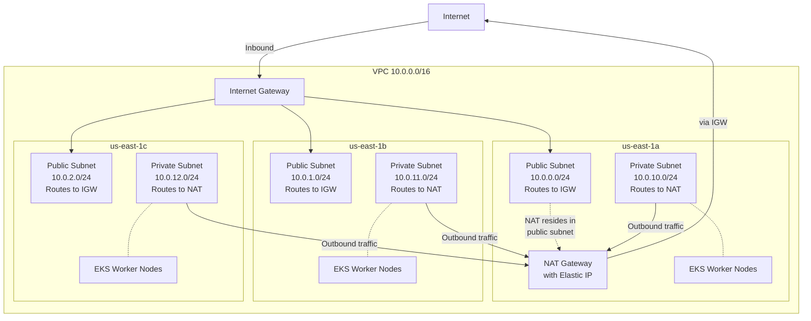

**Network Flow Explained:**

**Inbound (Internet → EKS):**
```
Internet → Internet Gateway → Load Balancer (Public Subnet) → EKS Nodes (Private Subnet)
```

**Outbound (EKS → Internet):**
```
EKS Nodes (Private Subnet) → NAT Gateway (in Public Subnet) → Internet Gateway → Internet
```

**Key Components:**
- **3 Availability Zones:** High availability across multiple data centers
- **Public Subnets:**
  - Route table: `0.0.0.0/0 → Internet Gateway`
  - Contains: NAT Gateway, Load Balancers
  - Can receive inbound internet traffic
- **Private Subnets:**
  - Route table: `0.0.0.0/0 → NAT Gateway`
  - Contains: EKS worker nodes and pods
  - No direct internet access (inbound blocked)
  - Can make outbound requests via NAT Gateway
- **NAT Gateway:**
  - Deployed in public subnet (us-east-1a)
  - Has Elastic IP for outbound traffic
  - Allows private subnet resources to download packages, pull images, etc.
  - Blocks all inbound connections from internet
  - Single NAT in dev (cost optimization), per-AZ in prod (HA)
- **Security Groups:** Least privilege access between components

---

### EKS Cluster Architecture

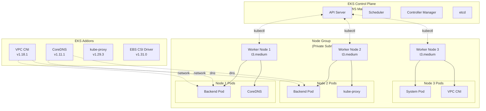

**Key Features:**
- **Managed Control Plane:** AWS handles API server, etcd, etc.
- **Kubernetes 1.34:** Latest stable version (configurable per environment)
- **Managed Node Groups:** Auto-scaling, auto-healing
- **EKS Addons:** VPC CNI for networking, CoreDNS for DNS, EBS CSI for storage, CloudWatch Observability for logging
- **IRSA Enabled:** IAM Roles for Service Accounts for pod-level permissions

---

## 3. CI/CD Pipeline Architecture

### Branch-Based Deployment Strategy

The CI/CD pipeline uses **branch-based deployments** where branch names automatically determine target environments:

- **develop** → auto-deploy to **dev**
- **release/*** → auto-deploy to **qa**
- **master/main** → manual deploy to **prod**
- **feature/*** → build/test only (no deploy)
- **hotfix/*** → auto-deploy to **dev**

📖 **For complete Git workflow details**, see [Git Workflow Documentation](GIT-WORKFLOW.md)

### Complete CI/CD Flow

```mermaid
graph LR
    subgraph "Developer"
        CODE[Write Code]
        COMMIT[Git Commit]
        PUSH[Git Push]
    end

    subgraph "GitHub"
        REPO[Repository]
        PR[Pull Request]
        BRANCHES[Branches<br/>develop/release/master]
    end

    subgraph "GitHub Actions<br/>Backend CI"
        CHECKOUT[Checkout Code]
        BUILD[Maven Build]
        TEST[Unit Tests]
        BRANCH_DETECT[Detect Branch<br/>Determine Environment]
        VERSION[Generate Version<br/>Based on Branch]
        DOCKER[Docker Build<br/>Multi-platform]
        SCAN[Trivy Scan]
        PUSH_ECR[Push to ECR]
        HELM[Package Helm Chart]
        PUSH_S3[Push to S3]
    end

    subgraph "GitHub Actions<br/>Backend CD"
        TRIGGER[Trigger on CI Success]
        ENV_DETECT[Read Branch Metadata<br/>Select Environment]
        AUTH[AWS OIDC Auth]
        KUBE[Get EKS Credentials]
        DEPLOY[Helm Deploy]
        HEALTH[Health Check]
    end

    subgraph "AWS"
        ECR[ECR Registry<br/>Docker Images]
        S3[S3 Bucket<br/>Helm Charts]
        EKS[EKS Cluster]
    end

    CODE --> COMMIT
    COMMIT --> PUSH
    PUSH --> REPO
    REPO --> PR
    PR --> BRANCHES
    BRANCHES --> CHECKOUT

    CHECKOUT --> BUILD
    BUILD --> TEST
    TEST --> BRANCH_DETECT
    BRANCH_DETECT --> VERSION
    VERSION --> DOCKER
    DOCKER --> SCAN
    SCAN --> PUSH_ECR
    PUSH_ECR --> HELM
    HELM --> PUSH_S3

    PUSH_S3 --> TRIGGER
    TRIGGER --> ENV_DETECT
    ENV_DETECT --> AUTH
    AUTH --> KUBE
    KUBE --> DEPLOY
    DEPLOY --> HEALTH

    PUSH_ECR --> ECR
    PUSH_S3 --> S3
    DEPLOY --> EKS

    ECR -.pull.-> EKS
    S3 -.pull.-> DEPLOY
```

**Pipeline Stages:**

**Stage 1: CI (Continuous Integration)**
1. **Build:** Maven compiles Java code
2. **Test:** Execute unit tests
3. **Branch Detection:** Identify branch and determine target environment
4. **Version:** Generate semantic version with branch suffix (e.g., `-dev`, `-rc`)
5. **Docker:** Build multi-platform image (amd64, arm64)
6. **Scan:** Trivy security vulnerability scan
7. **Publish:** Push image to ECR, chart to S3

**Stage 2: CD (Continuous Deployment)**
1. **Trigger:** Automatic after CI success (for deployable branches)
2. **Environment Selection:** Read branch metadata to determine target environment
3. **Auth:** GitHub OIDC to AWS
4. **Deploy:** Helm upgrade --install to target environment
5. **Verify:** Health check endpoints

---

### GitHub Actions Workflow Relationships

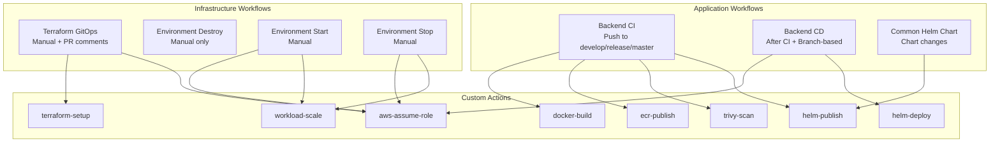

**Workflow Types:**
- **Manual Dispatch:** User triggers from Actions UI
- **Push Trigger:** Automatic on code push (branch-based)
- **PR Trigger:** Automatic on pull request
- **PR Comment:** `/terraform plan dev` commands
- **Workflow Completion:** CD triggers after CI (branch-based environment)

### Branch-to-Environment Deployment Flow

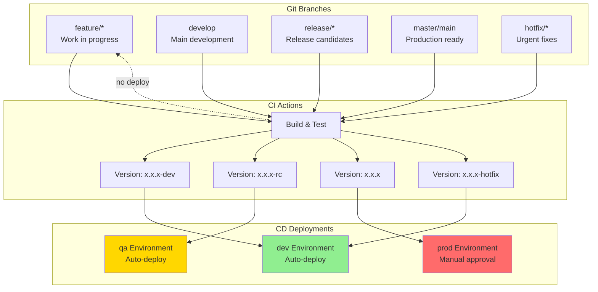

**Deployment Rules:**
- ✅ **feature/*** → Build/test only, no deployment
- ✅ **develop** → Auto-deploy to dev (~5 min)
- ✅ **release/*** → Auto-deploy to qa (~5 min)
- ⚠️  **master** → Manual approval required for prod
- ⚠️  **hotfix/*** → Auto-deploy to dev for testing

📖 **For workflow details and usage examples**, see [Git Workflow Documentation](GIT-WORKFLOW.md)

---

## 4. Terraform Staged Deployment

### Dependency Flow

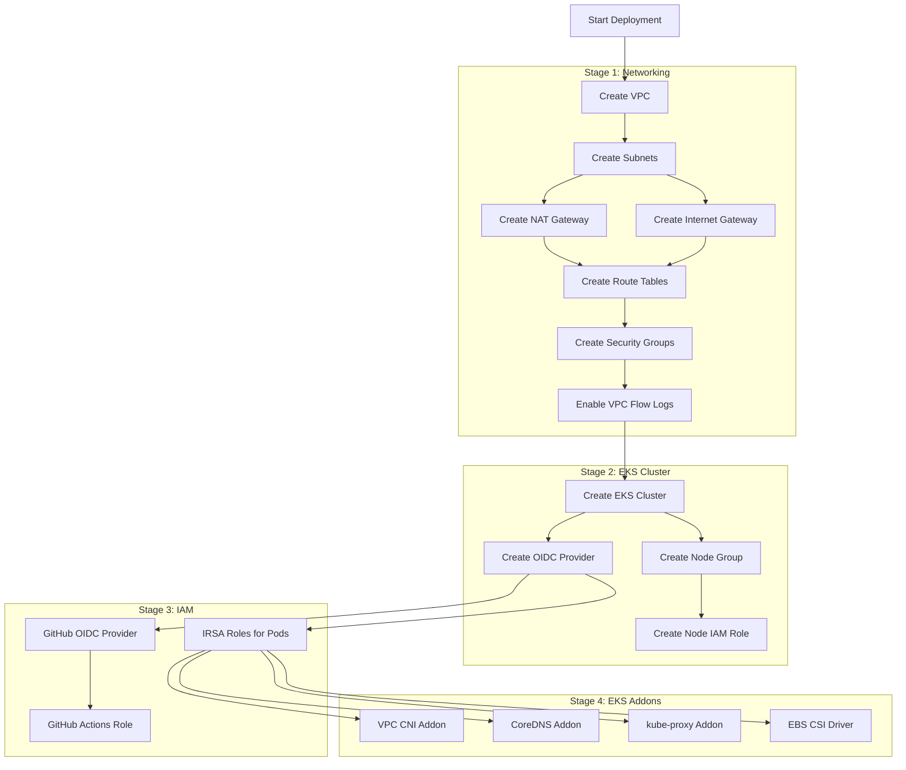

**Why Staged Deployment?**

**The Problem:**
- EKS cluster needs VPC and subnets
- IAM IRSA roles need EKS OIDC provider URL
- EKS addons need IRSA role ARNs
- Circular dependency: EKS ← → IAM

**The Solution:**
1. **Stage 1:** Create networking (no dependencies)
2. **Stage 2:** Create EKS cluster (uses networking outputs)
3. **Stage 3:** Create IAM roles (uses EKS OIDC URL)
4. **Stage 4:** Install EKS addons (uses IAM role ARNs)

**Benefits:**
- ✅ No circular dependencies
- ✅ No complex mocks or dummy values
- ✅ Clear dependency chain
- ✅ Can update single stage independently
- ✅ Easier to troubleshoot

---

### Terraform State Management

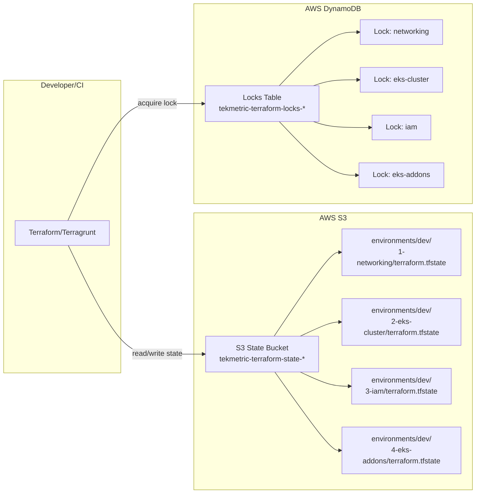

**State Management Features:**
- **Remote State:** S3 bucket per AWS account
- **State Locking:** DynamoDB prevents concurrent modifications
- **Encryption:** S3 bucket encryption at rest
- **Versioning:** S3 versioning enabled for state recovery
- **Per-Stage State:** Each stage has independent state file
- **Per-Environment:** Separate states for dev, qa, prod

---

## 5. Application Deployment Architecture

### Helm Chart Structure

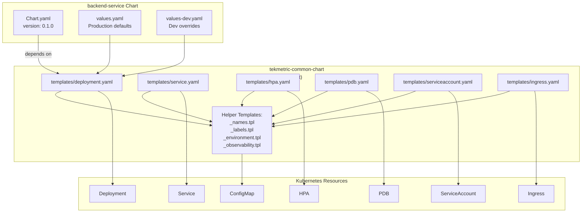

**Chart Pattern Benefits:**
- **DRY:** One common chart, multiple services
- **Consistency:** All services deploy the same way
- **Maintainable:** Update once, affects all services
- **Production-Ready:** Built-in best practices

---

### Kubernetes Deployment Flow

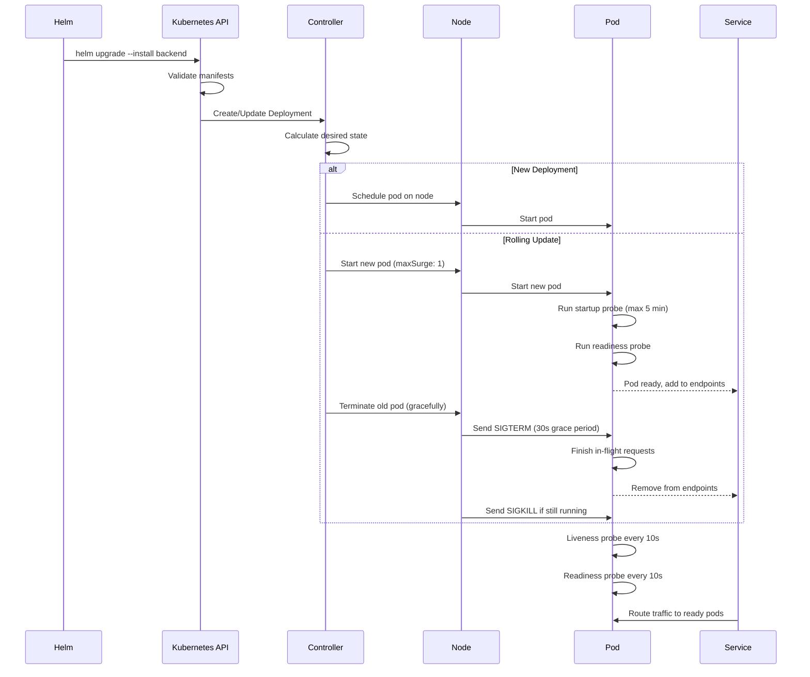

**Deployment Guarantees:**
- **Zero Downtime:** maxUnavailable: 0
- **Gradual Rollout:** maxSurge: 1 (one extra pod during update)
- **Health Checks:** Startup, liveness, readiness probes
- **Graceful Shutdown:** 30-second termination grace period
- **Automatic Rollback:** --atomic flag rolls back on failure

---

## 6. Observability Architecture

### Current Implementation

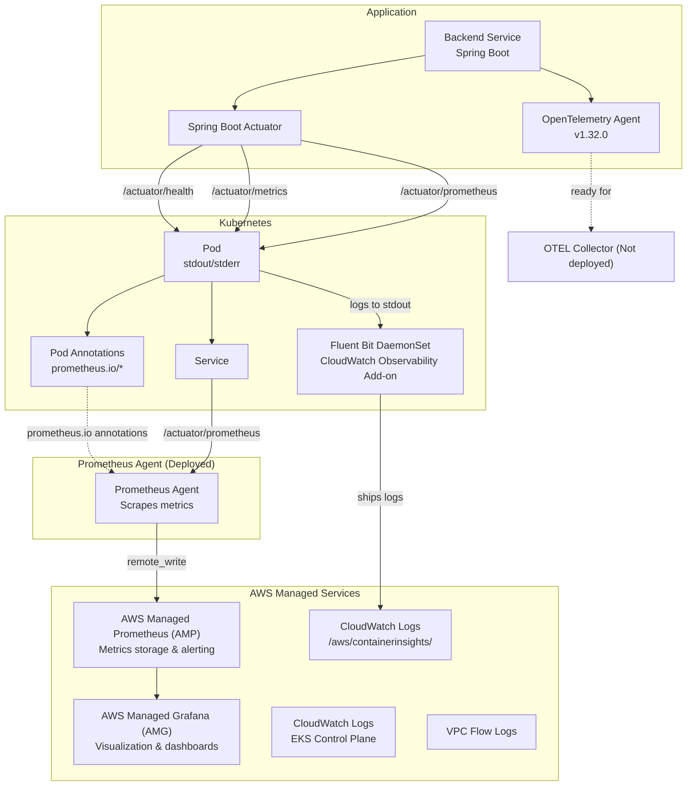

**Current State:**
- ✅ Spring Boot Actuator enabled
- ✅ Prometheus metrics exposed at `/actuator/prometheus`
- ✅ OpenTelemetry agent integrated (ready for tracing)
- ✅ CloudWatch Observability add-on deployed (Fluent Bit)
- ✅ Pod logs automatically shipped to CloudWatch
- ✅ CloudWatch control plane logging enabled
- ✅ Health probes configured (liveness, readiness, startup)
- ✅ AWS Managed Prometheus (AMP) workspace deployed
- ✅ AWS Managed Grafana (AMG) workspace deployed
- ✅ Grafana datasource configured (AMP with SigV4 auth)
- ✅ Prometheus Agent deployed (scraping metrics → AMP)
- ✅ Alert rules configured in AMP (8 rules)
- ✅ SNS topic for alert notifications
- ⚠️ Grafana dashboards need creation
- ⚠️ OTEL Collector not deployed (traces not collected yet)
- ⚠️ Tracing backend not deployed (Jaeger/Tempo)

---

### Future Complete Stack

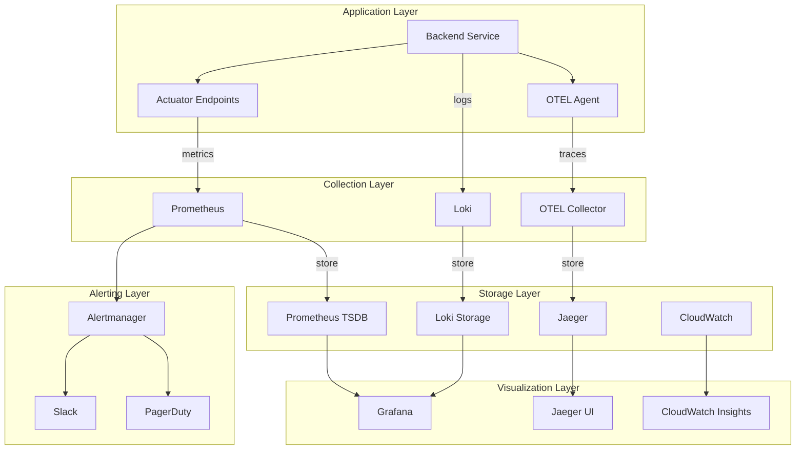

**Three Pillars Complete:**
1. **Metrics:** Prometheus → Grafana dashboards
2. **Logs:** Loki → Grafana log explorer
3. **Traces:** OTEL → Jaeger distributed tracing

---

### Metrics Flow

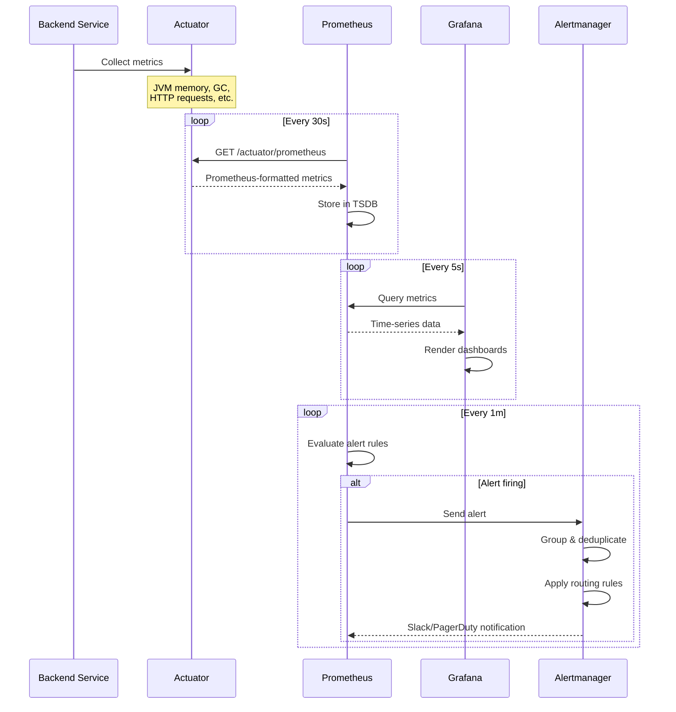

---

## 7. Security Architecture

### Authentication & Authorization

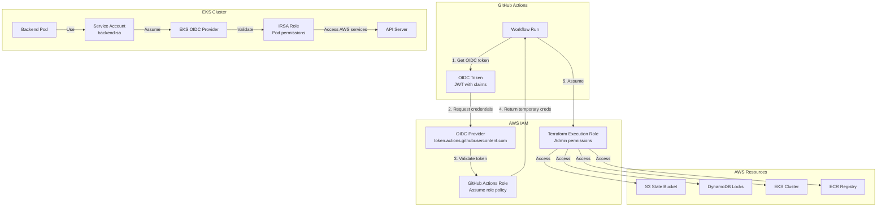

**Security Benefits:**
- **No Long-Lived Credentials:** Temporary tokens only
- **Scoped Permissions:** GitHub Actions role limited to CI/CD
- **Pod-Level Permissions:** IRSA for granular AWS access
- **Automatic Rotation:** Credentials expire automatically
- **Audit Trail:** CloudTrail logs all API calls

---

### Network Security

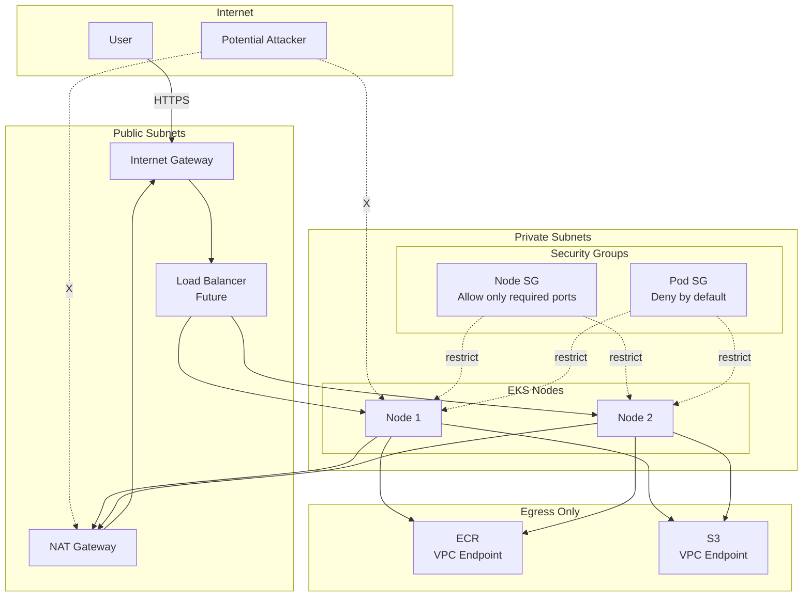

**Security Layers:**
1. **Network Isolation:** Nodes in private subnets (no direct internet access)
2. **Security Groups:** Least privilege access between components
3. **VPC Endpoints:** Traffic to AWS services stays within AWS network
4. **NACLs:** Additional network-level firewall (optional)
5. **Pod Security:** Non-root containers, dropped capabilities

---

### Container Security

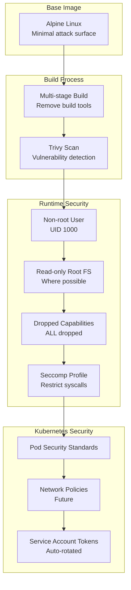

**Security Measures:**
- ✅ Alpine Linux base (minimal)
- ✅ Multi-stage builds
- ✅ Trivy security scanning
- ✅ Non-root user (UID 1000)
- ✅ Dropped capabilities
- ✅ Security contexts in Helm
- ⏳ Network policies (future)
- ⏳ Seccomp profiles (future)

---

## 8. Cost Optimization

### Cost Breakdown (Monthly)

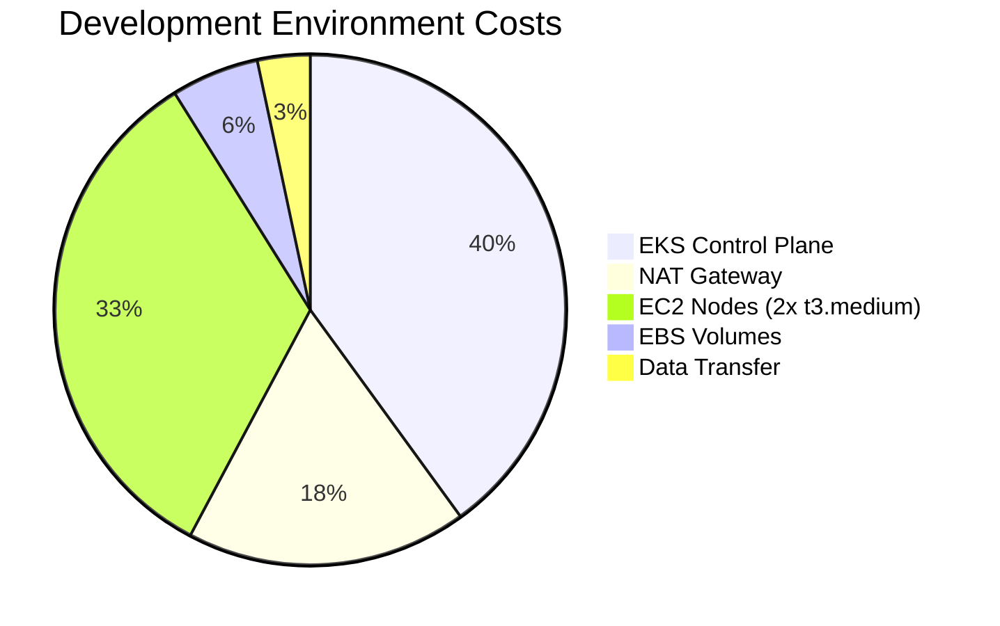

**Dev/QA Environment: ~$180/month**
- EKS Control Plane: $72 (fixed)
- NAT Gateway: $32 (1 NAT)
- EC2 Nodes: $60 (2x t3.medium)
- Storage: $10 (EBS volumes)
- Data Transfer: $6 (estimate)

**Production Environment: ~$520/month**
- EKS Control Plane: $72 (fixed)
- NAT Gateways: $96 (3 NAT, one per AZ)
- EC2 Nodes: $300 (5x t3.large)
- Storage: $30 (EBS volumes)
- Data Transfer: $22 (estimate)

---

### Cost Optimization Strategies

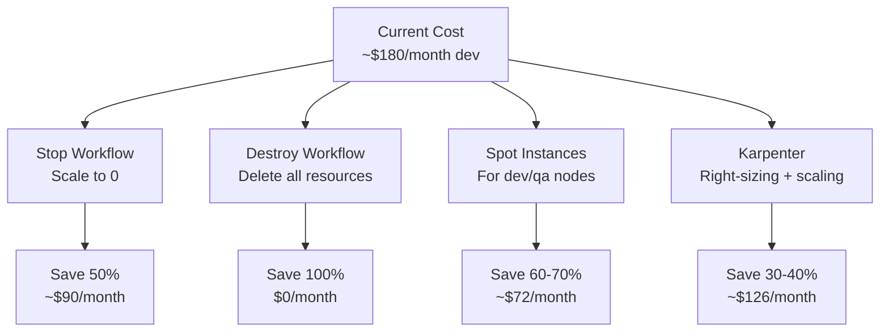

**Implemented:**
- ✅ Stop/Start workflows (save 50%)
- ✅ Single NAT in dev (save $32/month vs 3 NATs)
- ✅ Smaller instances in dev (t3.medium vs t3.large)
- ✅ Destroy workflow for complete teardown

**Future Optimizations:**
- ⏳ Spot instances for dev/qa (60-70% savings)
- ⏳ Karpenter for intelligent scaling
- ⏳ S3 lifecycle policies for old charts
- ⏳ CloudWatch log retention policies

---

## 9. Disaster Recovery

### Backup Strategy

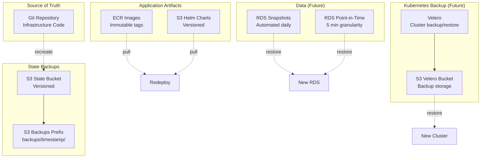

**Recovery Scenarios:**

**1. Lost Infrastructure (Account compromised):**
- **RTO:** 30 minutes
- **RPO:** 0 (infrastructure as code)
- **Process:**
  1. Create new AWS account
  2. Run bootstrap Terraform
  3. Deploy staged infrastructure
  4. Redeploy applications

**2. Accidental Resource Deletion:**
- **RTO:** 5-10 minutes
- **RPO:** Last Terraform apply
- **Process:**
  1. terraform plan (review what's missing)
  2. terraform apply (recreate resources)

**3. Database Corruption (Future with RDS):**
- **RTO:** 15-30 minutes
- **RPO:** 5 minutes (point-in-time recovery)
- **Process:**
  1. Identify corruption time
  2. Restore from snapshot before corruption
  3. Point-in-time recovery to exact timestamp
  4. Update application config

**4. Complete EKS Cluster Loss:**
- **RTO:** 20-30 minutes
- **RPO:** Last deployment
- **Process:**
  1. Deploy EKS via Terraform
  2. Redeploy applications via Helm
  3. Verify health checks

---

## 10. Scaling Considerations

### Horizontal Scaling

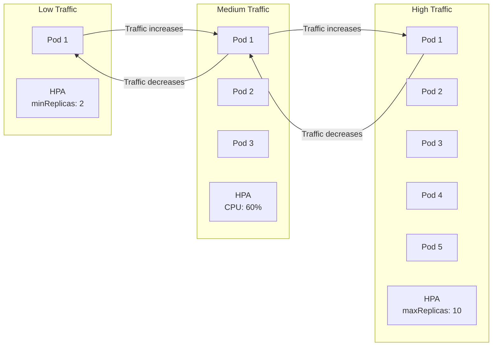

**HPA Configuration:**
```yaml
autoscaling:
  enabled: true
  minReplicas: 2           # Always 2 pods minimum
  maxReplicas: 10          # Scale up to 10 pods
  targetCPU: 70            # Scale when CPU > 70%
  targetMemory: 80         # Scale when memory > 80%
```

---

### Cluster Autoscaling

```mermaid
graph TB
    subgraph "Initial State"
        NODE1[Node 1<br/>60% utilized]
        NODE2[Node 2<br/>55% utilized]
    end

    subgraph "High Pod Demand"
        POD_PENDING[Pending Pods<br/>Cannot schedule]
    end

    subgraph "Cluster Autoscaler Action"
        CA[Cluster Autoscaler]
        ASG[Auto Scaling Group]
    end

    subgraph "Scaled State"
        NODE3[Node 1]
        NODE4[Node 2]
        NODE5[Node 3<br/>NEW]
        NODE6[Node 4<br/>NEW]
    end

    POD_PENDING -->|Detects| CA
    CA -->|Scales| ASG
    ASG -->|Adds nodes| NODE5
    ASG -->|Adds nodes| NODE6
```

**Cluster Autoscaler:**
- Monitors for pending pods
- Adds nodes when pods can't be scheduled
- Removes underutilized nodes after 10 minutes
- Respects Pod Disruption Budgets

---

## Summary

This architecture demonstrates production-ready practices:
- **Modularity:** Reusable Terraform modules
- **Isolation:** Multi-account setup
- **Security:** OIDC, IRSA, security contexts
- **Reliability:** HA, health checks, graceful shutdown
- **Observability:** Metrics, logs, traces (framework)
- **Cost Optimization:** Stop/start, right-sizing
- **Automation:** Complete CI/CD pipeline
- **Disaster Recovery:** Infrastructure as code, backups

All diagrams are rendered using Mermaid for easy updates and version control.
