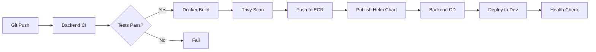

# Interview Presentation - 10 Minutes

## Related Documentation

This presentation provides a high-level overview for a 10-minute interview format. For detailed information:

- **Complete Architecture:** [ARCHITECTURE.md](ARCHITECTURE.md) - Detailed diagrams and technical explanations
- **Infrastructure Setup:** [SETUP-GUIDE.md](SETUP-GUIDE.md) - Step-by-step deployment instructions
- **Observability Stack:** [OBSERVABILITY.md](OBSERVABILITY.md) - Complete metrics, logging, and tracing implementation
- **CI/CD Workflows:** [github/workflows.md](github/workflows.md) - Detailed workflow documentation and usage
- **Git Workflow:** [GIT-WORKFLOW.md](GIT-WORKFLOW.md) - Branch strategy and deployment process
- **Staged Deployment:** [STAGED-DEPLOYMENT.md](STAGED-DEPLOYMENT.md) - Terraform deployment strategy

---

## Presentation Structure

**Total Time:** 10 minutes
- Introduction: 1 minute
- Architecture Overview: 2 minutes
- Infrastructure as Code: 2 minutes
- CI/CD Pipeline: 2 minutes
- Kubernetes & Helm: 2 minutes
- Observability: 1 minute

---

## Slide 1: Introduction (1 minute)

### Title: SRE Infrastructure - Production-Ready AWS EKS Deployment

**Overview:**
"I've built a complete SRE infrastructure showcasing Infrastructure as Code, CI/CD automation, production-ready Kubernetes deployments, and comprehensive observability."

**Technology Stack:**
- **Infrastructure:** Terraform, Terragrunt, AWS (VPC, EKS, ECR, S3, DynamoDB)
- **CI/CD:** GitHub Actions, GitHub OIDC
- **Containers:** Docker (multi-platform), Kubernetes 1.34, Helm
- **Application:** Java Spring Boot, H2 Database
- **Observability:** Spring Boot Actuator, OpenTelemetry, CloudWatch, Prometheus-ready

**What Makes It Production-Ready:**
- Multi-account AWS setup (dev, qa, prod isolation)
- GitHub OIDC (no long-lived credentials)
- Staged deployment approach
- Comprehensive health checks and monitoring
- Zero-downtime deployments
- Cost optimization workflows

---

## Slide 2: Architecture Overview (2 minutes)

### High-Level Architecture

```
GitHub Actions (OIDC) → AWS Multi-Account Setup
                        ├── Dev (VPC → EKS → Backend Pods)
                        ├── QA (VPC → EKS → Backend Pods)
                        └── Prod (VPC → EKS → Backend Pods)
                             ↓
                        ECR, S3 (Helm + TF State), CloudWatch
```

**Key Components:**
1. **Multi-Account:** Separate AWS accounts (dev/qa/prod) for isolation
2. **Networking:** Multi-AZ VPC with public/private subnets
3. **Kubernetes:** EKS 1.34 with managed node groups
4. **CI/CD:** GitHub Actions with OIDC (no static credentials)
5. **Storage:** ECR (images), S3 (Helm charts, Terraform state)
6. **Observability:** CloudWatch, AWS Managed Prometheus/Grafana

**Security Highlights:**
- GitHub OIDC authentication (no long-lived credentials)
- IRSA for pod-level IAM permissions
- Private subnets for workloads
- Non-root containers with dropped capabilities

📖 **For detailed architecture diagrams and explanations:**
- [ARCHITECTURE.md Section 1-2](ARCHITECTURE.md#1-high-level-system-architecture) - Complete network and AWS architecture
- [ARCHITECTURE.md Section 3](ARCHITECTURE.md#3-cicd-pipeline-architecture) - CI/CD pipeline details

---

## Slide 3: Infrastructure as Code (2 minutes)

### Staged Deployment Strategy

**The Problem:** Circular dependencies (EKS ↔ IAM)
- EKS needs IAM roles, IAM IRSA needs EKS OIDC URL

**The Solution:** 4-Stage Sequential Deployment
```
Stage 1: Networking (VPC, subnets, NAT)
    ↓
Stage 2: EKS Cluster
    ↓
Stage 3: IAM (IRSA roles)
    ↓
Stage 4: EKS Addons
```

**Key Benefits:**
- ✅ Eliminates circular dependencies (no mocks needed)
- ✅ Clear execution order and troubleshooting
- ✅ Granular updates (change one stage without affecting others)

### Infrastructure Stack

**Terraform Modules:**
- Bootstrap, Networking, EKS, EKS Add-ons, IAM, ECR, AMP, Grafana

**Terragrunt:**
- DRY principle with environment-specific overrides (dev/qa/prod)
- Remote state: S3 + DynamoDB locking
- Automated via GitHub Actions workflow

**Deployment Methods:**
1. GitHub Actions UI (select environment + stage)
2. PR comments: `/terraform apply dev 1-networking`
3. Local CLI: `cd environments/dev/1-networking && terragrunt apply`

📖 **For complete infrastructure details:**
- [STAGED-DEPLOYMENT.md](STAGED-DEPLOYMENT.md) - Complete staged deployment strategy
- [ARCHITECTURE.md Section 4](ARCHITECTURE.md#4-terraform-staged-deployment-architecture) - Detailed dependency flow
- [SETUP-GUIDE.md](SETUP-GUIDE.md) - Step-by-step deployment instructions

---

## Slide 4: CI/CD Pipeline (2 minutes)

### GitHub Actions Workflows



**Pipeline Flow:**
1. **Backend CI:** Build → Test → Docker (multi-platform) → Trivy Scan → Publish (ECR + Helm)
2. **Backend CD:** Auto-deploy to dev/qa/prod based on branch
3. **Security:** All builds scanned with Trivy, results in GitHub Security tab
4. **Authentication:** GitHub OIDC (no static credentials)

**Key Features:**
- Branch-based versioning: `1.0.0.42-abc1234-dev`
- Multi-platform images (amd64, arm64)
- 8 custom reusable actions (DRY principle)
- Automated deployment: develop → dev, release/* → qa, master → prod

📖 **For complete CI/CD details:**
- [github/workflows.md](github/workflows.md) - Complete workflow documentation
- [github/actions.md](github/actions.md) - Custom composite actions details

---

## Slide 5: Kubernetes & Production-Ready Helm Charts (2 minutes)

### Helm Chart Architecture

**Common Library Chart Pattern:**
```
helm/
├── backend/                    # Application chart
│   ├── Chart.yaml             # Depends on tekmetric-common-chart
│   ├── values.yaml            # Production defaults
│   └── values-dev.yaml        # Dev overrides
└── common/
    └── charts/tekmetric-common-chart/    # Library chart
        ├── templates/
        │   ├── deployment.yaml
        │   ├── service.yaml
        │   ├── hpa.yaml
        │   ├── pdb.yaml
        │   └── ingress.yaml
        └── values.yaml
```

**DRY Benefits:**
- Single chart for all services
- Consistent deployment patterns
- Production features built-in
- Easy to add new services

### Production Features

**7 Key Production Features Built-In:**
1. **Resource Management** - CPU/memory limits and requests
2. **Health Probes** - Liveness, readiness, startup probes
3. **High Availability** - Pod Disruption Budgets, anti-affinity
4. **Zero-Downtime Deployments** - Rolling updates (maxUnavailable: 0)
5. **Security** - Non-root containers, dropped capabilities, seccomp
6. **Autoscaling (HPA)** - CPU/memory-based scaling
7. **IRSA Support** - Pod-level IAM permissions

**Benefits:**
- Self-healing (automatic restarts via health probes)
- Graceful shutdown (30s termination grace period)
- No privilege escalation
- Immutable deployment patterns

📖 **For complete Helm production features and YAML examples:**
- [helm/PRODUCTION-FEATURES.md](helm/PRODUCTION-FEATURES.md) - Detailed guide with all configurations, best practices, and troubleshooting

---

## Slide 6: Observability (1 minute)

### Current Implementation

**Observability Stack:**
1. **Spring Boot Actuator** - Health probes, metrics endpoints
2. **AWS Managed Prometheus (AMP)** - Metrics storage and alerting (8 alert rules)
3. **AWS Managed Grafana (AMG)** - Visualization and dashboards
4. **CloudWatch** - Application and cluster logs (Fluent Bit integration)
5. **OpenTelemetry Agent** - Pre-installed, ready for distributed tracing

**Key Features:**
- ✅ Prometheus metrics exposed at `/actuator/prometheus`
- ✅ Health probes for Kubernetes (liveness, readiness, startup)
- ✅ Alert rules configured (service down, high error rate, memory, latency)
- ✅ SNS notifications for alerts
- ✅ Grafana datasource configured (AMP with SigV4 auth)
- ⚠️ Dashboards need creation

**Metrics Available:**
- JVM (memory, GC, threads), HTTP (requests, latency, errors), System (CPU, uptime)

**Next Steps:**
1. Create Grafana dashboards (backend service, EKS cluster)
2. Deploy OTEL Collector for distributed tracing
3. Set up alerting integrations (PagerDuty/Slack)

📖 **For complete observability details:**
- [OBSERVABILITY.md](OBSERVABILITY.md) - Complete implementation guide (metrics, logging, tracing)
- [observability/cd-workflow.md](observability/cd-workflow.md) - Automated deployment workflow
- [observability/backend-integration.md](observability/backend-integration.md) - Backend service integration

---

## Key Design Decisions

### 1. Why Staged Deployment?
**Problem:** Circular dependencies (EKS ← → IAM)
**Solution:** Sequential stages with clear outputs
**Benefit:** No mocks, no dependency complexity, easier troubleshooting

### 2. Why GitHub OIDC?
**Problem:** Long-lived AWS credentials in secrets
**Solution:** OpenID Connect with temporary credentials
**Benefit:** Better security, automatic rotation, no credential management

### 3. Why Multi-Account?
**Problem:** Single account for all environments
**Solution:** Separate AWS accounts per environment
**Benefit:** Isolation, cost tracking, independent deployments, blast radius containment

### 4. Why Helm Library Chart?
**Problem:** Duplicate chart code for each service
**Solution:** Single common chart, service-specific values
**Benefit:** DRY, consistency, production features built-in

### 5. Why OpenTelemetry?
**Problem:** Vendor lock-in with proprietary agents
**Solution:** Vendor-neutral OTEL agent
**Benefit:** Future-proof, supports any backend (Jaeger, Tempo, Datadog, New Relic)

### 6. Why Spring Boot Actuator?
**Problem:** No built-in application metrics
**Solution:** Actuator with Prometheus integration
**Benefit:** Production-ready endpoints, wide ecosystem support, easy to use

---

## Current Implementation Status

### ✅ Completed Components

**Infrastructure (Terraform/Terragrunt):**
- ✅ Multi-account AWS setup (dev, qa, prod)
- ✅ Staged deployment architecture (4 stages, eliminates circular dependencies)
- ✅ VPC with public/private subnets across 3 AZs
- ✅ EKS cluster (Kubernetes 1.34) with managed node groups
- ✅ GitHub OIDC provider (no long-lived credentials)
- ✅ IRSA roles for pod-level IAM permissions
- ✅ ECR repositories for container images
- ✅ S3-based Helm chart repository
- ✅ Remote state management (S3 + DynamoDB locking)

**CI/CD (GitHub Actions):**
- ✅ Backend CI workflow (build, test, scan, publish)
- ✅ Backend CD workflow (automated deployment)
- ✅ Multi-platform Docker builds (amd64, arm64)
- ✅ Security scanning with Trivy
- ✅ Branch-based versioning and deployment
- ✅ Terraform GitOps workflow
- ✅ Custom composite actions (reusable)
- ✅ Cost optimization workflows (start/stop)

**Kubernetes & Helm:**
- ✅ Production-ready Helm library chart (tekmetric-common-chart)
- ✅ Backend service deployment with all production features
- ✅ Health probes (liveness, readiness, startup)
- ✅ Resource limits and requests
- ✅ Pod Disruption Budgets
- ✅ Security contexts (non-root, dropped capabilities)
- ✅ Rolling update strategy (zero downtime)
- ✅ HPA support (configurable)

**Observability:**
- ✅ Spring Boot Actuator with Prometheus metrics
- ✅ OpenTelemetry Java agent integrated
- ✅ AWS Managed Prometheus (AMP) workspace deployed
- ✅ AWS Managed Grafana (AMG) workspace deployed
- ✅ Prometheus Agent Helm chart with IRSA
- ✅ Alert rules configured in AMP (8 rules: service down, high error rate, memory, latency, etc.)
- ✅ SNS topic for alert notifications
- ✅ CloudWatch Observability add-on (Fluent Bit)
- ✅ Pod logs forwarded to CloudWatch
- ✅ IAM permissions fixed for Grafana to query AMP alert rules
- ✅ Grafana datasource configured (AMP with SigV4 auth, alerts disabled)

### 🚧 In Progress / Needs Configuration

**Observability:**
- ⚠️ Grafana dashboards not yet created
- ⚠️ OpenTelemetry Collector not deployed
- ⚠️ Tracing backend (Jaeger/Tempo) not deployed

**Multi-Environment:**
- ⚠️ QA and Prod environments not fully deployed (Terraform code ready)
- ⚠️ Environment-specific configurations need validation

---

## Next Steps for Production Readiness

### Immediate (Complete Observability - 1-2 days)
1. **Create Grafana Dashboards:**
   - Backend service dashboard (request rate, latency, errors, JVM metrics)
   - EKS cluster dashboard (node CPU/memory, pod count, restarts)
   - Import community dashboards for Kubernetes monitoring

2. **Verify Alert Rules:**
   - Test alert firing by scaling backend to 0 replicas
   - Verify SNS email notifications
   - Confirm alerts visible in Grafana Explore

3. **Deploy OpenTelemetry Collector:**
   - Deploy OTEL Collector to observability namespace
   - Configure to receive traces and forward to backend
   - Enable OTEL in backend Helm values

### Short Term (Production Foundations - 1-2 weeks)
1. **Distributed Tracing:**
   - Deploy Jaeger or Tempo as tracing backend
   - Enable OpenTelemetry in backend application
   - Create service dependency map
   - Set up trace sampling (1-10% in prod)

2. **Alerting & On-Call:**
   - Integrate with PagerDuty or OpsGenie
   - Create runbooks for common alerts
   - Set up escalation policies
   - Test alert routing

3. **Deploy to QA Environment:**
   - Apply Terraform to QA account
   - Deploy backend service to QA EKS
   - Validate CI/CD pipeline (release branches → QA)
   - Test observability stack

4. **Enhanced Security:**
   - Deploy AWS Secrets Manager with External Secrets Operator
   - Rotate all credentials and secrets
   - Enable EKS pod security standards
   - Add network policies for pod-to-pod communication

5. **Documentation:**
   - Create operational runbooks
   - Document disaster recovery procedures
   - Create troubleshooting guides
   - Update architecture diagrams for observability

### Medium Term (Production Scaling - 1-2 months)
1. **GitOps & Continuous Delivery:**
   - Implement ArgoCD for declarative deployments
   - Git as single source of truth for K8s manifests
   - Automated sync and rollback capabilities
   - Progressive delivery with Argo Rollouts

2. **Database & Persistence:**
   - Replace H2 with Amazon RDS (PostgreSQL or MySQL)
   - Implement database migration strategy (Flyway/Liquibase)
   - Set up automated backups and point-in-time recovery
   - Configure read replicas for production

3. **Caching Layer:**
   - Deploy Amazon ElastiCache (Redis)
   - Implement caching strategy for frequently accessed data
   - Session management with Redis

4. **Service Mesh (if needed):**
   - Evaluate Istio vs Linkerd based on requirements
   - Implement for advanced traffic management (retries, circuit breakers)
   - Mutual TLS between services
   - Fine-grained authorization policies

5. **Deploy to Production:**
   - Apply Terraform to prod account
   - Deploy backend with higher replica count
   - Enable HPA and PDB
   - Validate disaster recovery procedures
   - Perform load testing

### Long Term (Advanced Capabilities - 3-6 months)
1. **Multi-Region:**
   - Deploy to us-west-2 for redundancy
   - Implement Route53 health checks and failover
   - Database replication across regions
   - Global load balancing

2. **Advanced Deployment Strategies:**
   - Blue/Green deployments for critical services
   - Canary deployments with automated rollback
   - Feature flags for gradual rollouts

3. **Cost Optimization:**
   - Implement Karpenter for intelligent node provisioning
   - Use Spot instances for non-critical workloads
   - Set up cost anomaly detection
   - Right-sizing recommendations based on metrics

4. **Compliance & Governance:**
   - Implement Open Policy Agent (OPA) or Kyverno
   - Policy-as-code for security and compliance
   - Automated compliance reporting
   - Audit logging and retention

5. **API Gateway:**
   - Deploy Kong or Ambassador for API management
   - Rate limiting and throttling
   - API versioning and deprecation
   - Developer portal

6. **Backup & Disaster Recovery:**
   - Implement Velero for Kubernetes backup/restore
   - Regular DR drills and testing
   - RTO/RPO documentation and validation
   - Automated recovery procedures

---

## Production Readiness Checklist

### Infrastructure
- ✅ Multi-account setup with environment isolation
- ✅ Infrastructure as Code (Terraform/Terragrunt)
- ✅ Automated provisioning via CI/CD
- ⚠️ QA environment deployment (code ready, needs deployment)
- ⚠️ Production environment deployment (code ready, needs deployment)
- ❌ Multi-region redundancy
- ❌ Disaster recovery tested and documented

### Security
- ✅ GitHub OIDC (no long-lived credentials)
- ✅ IRSA for pod-level IAM permissions
- ✅ Non-root containers with dropped capabilities
- ✅ Private subnets for application workloads
- ✅ Security groups and network policies
- ⚠️ Secrets management (using K8s secrets, should migrate to AWS Secrets Manager)
- ❌ Pod Security Standards enforced
- ❌ Network policies for pod-to-pod traffic
- ❌ Regular security scanning and patching process

### Observability
- ✅ Metrics exposed (Prometheus format)
- ✅ Application health probes
- ✅ Logging to CloudWatch
- ✅ AWS Managed Prometheus deployed
- ✅ AWS Managed Grafana deployed
- ✅ Grafana datasource configured (AMP with SigV4 auth)
- ✅ Alert rules configured
- ⚠️ Grafana dashboards (need creation)
- ⚠️ Distributed tracing (agent ready, collector not deployed)
- ❌ On-call rotation and escalation
- ❌ Runbooks for common incidents

### Reliability
- ✅ Zero-downtime deployments (rolling updates)
- ✅ Pod Disruption Budgets
- ✅ Health probes for self-healing
- ✅ Resource limits and requests
- ⚠️ HPA configured (disabled by default, ready to enable)
- ❌ Chaos engineering / resilience testing
- ❌ Load testing and capacity planning
- ❌ Validated DR procedures

### CI/CD
- ✅ Automated builds and tests
- ✅ Security scanning (Trivy)
- ✅ Multi-platform container images
- ✅ Branch-based deployment strategy
- ✅ Automated deployment to dev
- ⚠️ Automated deployment to QA (via release branches)
- ❌ Production deployment with approval gates
- ❌ Automated rollback on failure
- ❌ Deployment notifications (Slack/Teams)

### Database & State
- ✅ State management (S3 + DynamoDB locking)
- ❌ Production database (currently using H2 in-memory)
- ❌ Database migrations (Flyway/Liquibase)
- ❌ Automated backups
- ❌ Point-in-time recovery
- ❌ Read replicas for scaling

### Cost Management
- ✅ Start/stop workflows for dev/qa
- ✅ Environment-specific instance sizes
- ✅ Single NAT gateway in dev
- ❌ Spot instances for non-critical workloads
- ❌ Karpenter for intelligent scaling
- ❌ Cost anomaly detection
- ❌ Regular cost reviews

**Legend:**
- ✅ Implemented and working
- ⚠️ Partially implemented or needs configuration
- ❌ Not yet implemented

---

## Common Interview Questions & Answers

### Q: How do you handle secrets in the application?
**A:** Currently using Kubernetes Secrets. For production, I would recommend:
- AWS Secrets Manager with IRSA (already have IRSA framework)
- External Secrets Operator to sync from Secrets Manager
- Rotation policies for database credentials
- No secrets in code or Git

### Q: How would you handle a rollback?
**A:**
```bash
# Via Helm
helm rollback backend -n backend-services

# Via kubectl
kubectl rollout undo deployment/backend -n backend-services

# To specific revision
kubectl rollout undo deployment/backend --to-revision=2 -n backend-services
```
Helm's atomic flag ensures automatic rollback on deployment failure.

### Q: What about disaster recovery?
**A:** Multi-layered approach:
1. **Infrastructure:** Terraform code in Git - can recreate from scratch
2. **State Backups:** Terraform state versioned in S3
3. **Application:** Docker images in ECR with tags
4. **Data:** Would use RDS automated backups + point-in-time recovery
5. **Kubernetes:** Would add Velero for backup/restore

**RTO/RPO:**
- Infrastructure: ~30 min (automated deployment)
- Application: ~5 min (helm install)
- Data: Depends on backup strategy (< 1 hour with RDS)

### Q: How do you manage database migrations?
**A:** H2 is in-memory for demo. For production with RDS:
1. **Flyway/Liquibase** for schema management
2. **Init containers** to run migrations before app starts
3. **Separate migration job** for major changes
4. **Rollback scripts** for each migration
5. **Test migrations** in lower environments first

### Q: How would you optimize costs?
**A:** Already implemented:
- Start/Stop workflows for dev/qa (save 50% on compute)
- Single NAT gateway in dev (save $32/month)
- Smaller instance types in dev/qa

**Additional optimizations:**
- Spot instances for dev/qa nodes (60-70% savings)
- Karpenter for right-sizing
- Cluster autoscaler for scaling to zero
- S3 lifecycle policies for old Helm charts
- CloudWatch log retention policies

### Q: How do you ensure security?
**A:** Multi-layered security:
1. **Network:** Private subnets, security groups, NACLs
2. **Authentication:** GitHub OIDC (no static credentials), IRSA for pods
3. **Container:** Non-root user, dropped capabilities, security scanning
4. **K8s:** RBAC, Pod Security Standards, network policies
5. **Compliance:** Would add OPA/Kyverno for policy enforcement

### Q: How would you implement blue/green deployments?
**A:** Several approaches:
1. **Helm:** Deploy to separate namespace, switch ingress
2. **Flagger:** Automated canary with metrics analysis
3. **Argo Rollouts:** Progressive delivery with traffic shaping
4. **Service Mesh:** Istio/Linkerd for traffic splitting

Currently using rolling updates (zero downtime) which is suitable for most cases.

---

## Success Metrics

**For This Implementation:**
- Infrastructure provisioned in < 30 minutes (per environment)
- Zero-downtime deployments (maxUnavailable: 0)
- Automated testing (unit tests in CI)
- Security scanning (Trivy for all images)
- Cost optimization (start/stop workflows save 50%)

**Would Track in Production:**
- Deployment frequency (DORA metric)
- Lead time for changes (commit to production)
- Mean time to recovery (MTTR)
- Change failure rate
- Service availability (SLA: 99.9%)
- Response time (P95 < 200ms)

---

## Presentation Tips

1. **Start Strong:** "I've built a production-ready EKS infrastructure that demonstrates..."
2. **Be Concise:** Stick to 2 minutes per section (use timer)
3. **Show, Don't Just Tell:** Have terminal/browser ready for live demo
4. **Highlight Decisions:** Explain "why" not just "what"
5. **Be Honest:** "This is a demo/interview project. In production, I would also..."
6. **Engage:** Ask if they want to dive deeper into any area
7. **Time Management:** If running over, skip optional sections
8. **Prepare for Questions:** Have answers ready for common questions
9. **Show Enthusiasm:** Demonstrate passion for infrastructure and automation
10. **Connect to Business:** Explain how features reduce risk, save costs, enable velocity

---

## Quick Reference

**Demo Commands:**
```bash
# Infrastructure
cd sre/terragrunt/environments/dev
ls -la

# CI/CD
open https://github.com/YOUR_ORG/interview/actions

# Kubernetes
kubectl get nodes
kubectl get pods -n backend-services
kubectl describe deployment backend -n backend-services

# Observability
kubectl port-forward -n backend-services svc/backend 8080:8080
curl http://localhost:8080/actuator/health
curl http://localhost:8080/actuator/prometheus | grep jvm
```

**Key URLs:**
- GitHub Actions: `https://github.com/YOUR_ORG/interview/actions`
- AWS Console: `https://console.aws.amazon.com/eks/home?region=us-east-1`
- ECR: `https://console.aws.amazon.com/ecr/repositories?region=us-east-1`
- CloudWatch: `https://console.aws.amazon.com/cloudwatch/home?region=us-east-1`

---

## Closing Statement

"This infrastructure demonstrates production-ready practices for AWS EKS deployments. It's not just about getting something running - it's about building reliable, secure, observable, and maintainable infrastructure. The staged deployment approach, GitHub OIDC, Helm library charts, and comprehensive observability show thoughtful design decisions that balance developer experience with operational excellence. I'm excited to discuss any aspect in more detail and share my thought process behind these choices."

**Thank you! Questions?**
