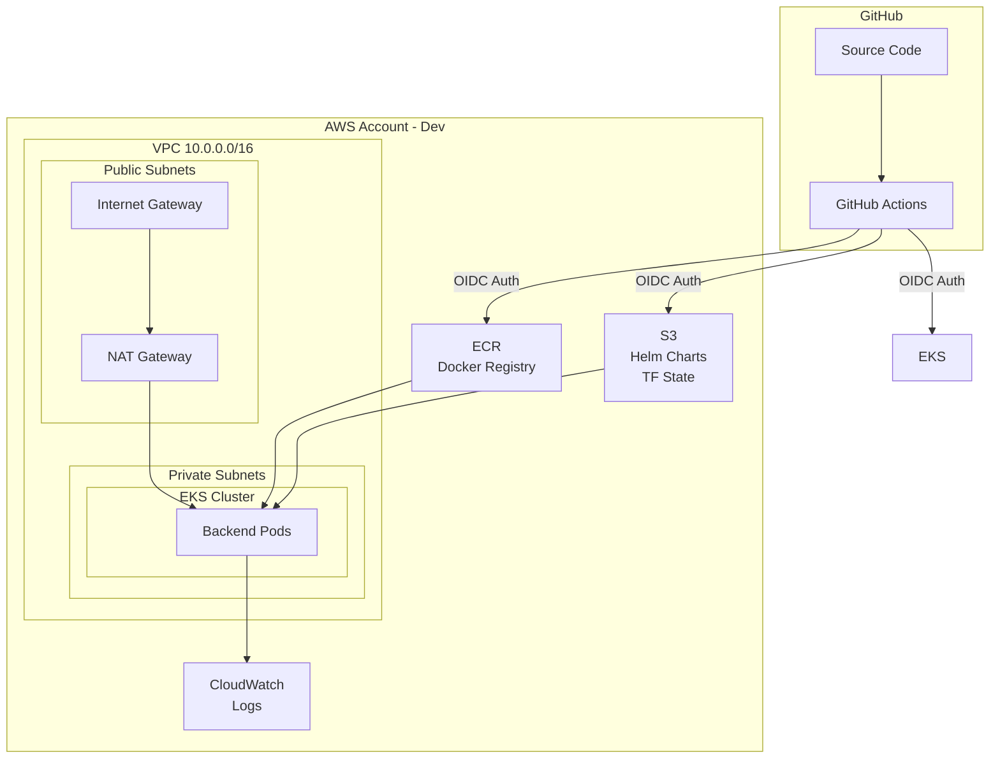

# Interview Presentation - 10 Minutes

## Presentation Structure

**Total Time:** 10 minutes
- Introduction: 1 minute
- Architecture Overview: 2 minutes
- Infrastructure as Code: 2 minutes
- CI/CD Pipeline: 2 minutes
- Kubernetes & Helm: 2 minutes
- Observability: 1 minute

---

## Slide 1: Introduction (1 minute)

### Title: SRE Infrastructure - Production-Ready AWS EKS Deployment

**Overview:**
"I've built a complete SRE infrastructure showcasing Infrastructure as Code, CI/CD automation, production-ready Kubernetes deployments, and comprehensive observability."

**Technology Stack:**
- **Infrastructure:** Terraform, Terragrunt, AWS (VPC, EKS, ECR, S3, DynamoDB)
- **CI/CD:** GitHub Actions, GitHub OIDC
- **Containers:** Docker (multi-platform), Kubernetes 1.34, Helm
- **Application:** Java Spring Boot, H2 Database
- **Observability:** Spring Boot Actuator, OpenTelemetry, CloudWatch, Prometheus-ready

**What Makes It Production-Ready:**
- Multi-account AWS setup (dev, qa, prod isolation)
- GitHub OIDC (no long-lived credentials)
- Staged deployment approach
- Comprehensive health checks and monitoring
- Zero-downtime deployments
- Cost optimization workflows

---

## Slide 2: Architecture Overview (2 minutes)

### High-Level Architecture Diagram



**Key Components:**
1. **Multi-Account Structure:** Separate AWS accounts for dev, qa, prod
2. **Networking:** Multi-AZ VPC with public/private subnets
3. **Kubernetes:** EKS 1.34 with managed node groups
4. **Container Registry:** ECR for Docker images
5. **Helm Repository:** S3-based chart storage
6. **State Management:** S3 + DynamoDB for Terraform state
7. **Logging:** CloudWatch for cluster and application logs

**Security Highlights:**
- GitHub OIDC for authentication (no static credentials)
- IRSA for pod-level IAM permissions
- Private subnets for application workloads
- Security groups and network policies
- Non-root containers with dropped capabilities

---

## Slide 3: Infrastructure as Code (2 minutes)

### Staged Deployment Strategy

**The Problem:** Circular dependencies between EKS and IAM
- EKS needs IAM roles for node groups
- IAM IRSA roles need EKS OIDC URL
- Traditional approaches use complex mocks or manual ordering

**The Solution:** Staged Deployment
```
Stage 1: Networking
  ↓ (outputs: vpc_id, subnet_ids)
Stage 2: EKS Cluster
  ↓ (outputs: oidc_url, cluster_endpoint)
Stage 3: IAM
  ↓ (outputs: role_arns)
Stage 4: EKS Addons
```

**Benefits:**
- ✅ No circular dependencies
- ✅ Clear execution order
- ✅ Granular control
- ✅ Easy troubleshooting
- ✅ Can update single stage without affecting others

### Terraform + Terragrunt Structure

**Terraform Modules:**
```
terraform/modules/
├── bootstrap/      # S3 backend, OIDC, DynamoDB
├── networking/     # VPC, subnets, NAT, SGs
├── eks/            # EKS cluster + node groups
├── eks-addons/     # VPC CNI, CoreDNS, EBS CSI
├── iam/            # OIDC + IRSA roles
└── ecr/            # Container registries
```

**Terragrunt Configuration:**
```
terragrunt/
├── terragrunt.hcl              # Root config
└── environments/
    ├── dev/
    │   ├── account.hcl         # env-specific: k8s_version, account_id
    │   ├── region.hcl          # region and AZs
    │   ├── 1-networking/       # Stage 1
    │   ├── 2-eks-cluster/      # Stage 2
    │   ├── 3-iam/              # Stage 3
    │   └── 4-eks-addons/       # Stage 4
    ├── qa/
    └── prod/
```

**Key Features:**
- **DRY Principle:** Modules reused across environments
- **Environment-Specific:** k8s_version, instance types, replica counts per environment
- **Remote State:** S3 with DynamoDB locking
- **Provider Generation:** Terragrunt auto-generates provider configs

### Deployment Methods

1. **GitHub Actions UI:** Select environment + stage → plan/apply
2. **PR Comments:** `/terraform plan dev 1-networking`
3. **Local CLI:** `cd environments/dev/networking && terragrunt apply`

**Example Deployment:**
```bash
# Fresh environment (4 sequential runs)
1. /terraform apply dev 1-networking
2. /terraform apply dev 2-eks-cluster
3. /terraform apply dev 3-iam
4. /terraform apply dev 4-eks-addons

# Update single module
/terraform apply dev 3-iam
```

---

## Slide 4: CI/CD Pipeline (2 minutes)

### GitHub Actions Workflows


**Backend CI Workflow (service-backend-ci.yml):**
1. **Build & Test:**
   - Maven compilation (Java 8)
   - Unit test execution
   - Branch detection and environment mapping
   - Version generation: `<base>.<build>-<sha>-<suffix>` (suffix: `-dev`, `-rc`, or none)

2. **Docker Build:**
   - Multi-platform (amd64, arm64)
   - OpenTelemetry agent pre-installed
   - Security best practices (non-root user, Alpine base)

3. **Security:**
   - Trivy vulnerability scanning (ALL builds)
   - SARIF report to GitHub Security tab
   - Configurable severity thresholds

4. **Publish (deployable branches only):**
   - Push image to ECR (develop, release/*, master, hotfix/*)
   - Package and publish Helm chart to S3

**Backend CD Workflow (service-backend-cd.yml):**
1. **Automatic Trigger:** After CI completes (deployable branches only, NOT PRs)
2. **Environment Determination:** Branch-based (develop → dev, release/* → qa, master → prod)
3. **AWS Authentication:** GitHub OIDC (no credentials)
4. **Deployment:** Helm upgrade --install with atomic flag
5. **Verification:** Health check endpoints and smoke tests

### Custom Composite Actions

**Reusable building blocks:**
- `terraform-setup`: Install Terraform/Terragrunt with caching
- `aws-assume-role`: OIDC-based AWS authentication
- `docker-build`: Local Docker image builds (no push)
- `ecr-publish`: Publish images to Amazon ECR
- `trivy-scan`: Container security scanning
- `helm-publish`: Chart validation and publishing
- `helm-deploy`: Kubernetes deployment
- `workload-scale`: Cost optimization (start/stop)

**Benefits:**
- Consistent across workflows
- Easy to maintain
- Reduced duplication
- Testable in isolation

### Version Management

**Branch-Based Versioning:**
```
Format: <base>.<build>-<sha>-<suffix>

Examples:
- develop:    1.0.0.42-abc1234-dev
- release/*:  1.0.0.42-abc1234-rc
- master:     1.0.0.42-abc1234
- feature/*:  1.0.0.42-abc1234-feature-{name}
- hotfix/*:   1.0.0.42-abc1234-hotfix-{name}

Components:
- Base: from pom.xml (1.0.0)
- Build: GitHub Actions run number (42)
- SHA: Short git commit hash (abc1234)
- Suffix: Determined by branch name
```

**Image Tagging:**
- Branch-based tags only (no `latest` tag)
- Each build has unique version based on branch

---

## Slide 5: Kubernetes & Production-Ready Helm Charts (2 minutes)

### Helm Chart Architecture

**Common Library Chart Pattern:**
```
helm/
├── backend/                    # Application chart
│   ├── Chart.yaml             # Depends on tekmetric-common-chart
│   ├── values.yaml            # Production defaults
│   └── values-dev.yaml        # Dev overrides
└── common/
    └── charts/tekmetric-common-chart/    # Library chart
        ├── templates/
        │   ├── deployment.yaml
        │   ├── service.yaml
        │   ├── hpa.yaml
        │   ├── pdb.yaml
        │   └── ingress.yaml
        └── values.yaml
```

**DRY Benefits:**
- Single chart for all services
- Consistent deployment patterns
- Production features built-in
- Easy to add new services

### Production Features

**1. Resource Management:**
```yaml
resources:
  limits:
    cpu: 1000m
    memory: 1Gi
  requests:
    cpu: 250m
    memory: 512Mi
```
- Prevents resource exhaustion
- Enables proper scheduling
- Supports HPA decisions

**2. Health Probes:**
```yaml
livenessProbe:     # Restart if unhealthy
  path: /actuator/health/liveness
  initialDelaySeconds: 60

readinessProbe:    # Remove from service if not ready
  path: /actuator/health/readiness
  initialDelaySeconds: 30

startupProbe:      # Allow slow startup (30 * 10s = 5 min max)
  failureThreshold: 30
```

**3. High Availability:**
```yaml
podDisruptionBudget:
  enabled: true
  minAvailable: 1    # Always keep 1 pod running

affinity:
  enabled: true
  type: soft         # Spread pods across nodes
```

**4. Zero-Downtime Deployments:**
```yaml
strategy:
  type: RollingUpdate
  rollingUpdate:
    maxSurge: 1           # Extra pod during update
    maxUnavailable: 0     # No downtime

terminationGracePeriodSeconds: 30   # Graceful shutdown
```

**5. Security:**
```yaml
podSecurityContext:
  runAsNonRoot: true
  runAsUser: 1000
  fsGroup: 1000

securityContext:
  allowPrivilegeEscalation: false
  readOnlyRootFilesystem: false    # Spring Boot needs write
  capabilities:
    drop: [ALL]
```

**6. Autoscaling (Optional):**
```yaml
autoscaling:
  enabled: false      # Enable for production
  minReplicas: 2
  maxReplicas: 10
  targetCPU: 70       # Scale at 70% CPU
  targetMemory: 80    # Scale at 80% memory
```

**7. IRSA Support:**
```yaml
serviceAccount:
  create: true
  name: backend-sa
  annotations:
    eks.amazonaws.com/role-arn: "arn:aws:iam::...:role/backend-irsa"
```
- Pod-level IAM permissions
- No credentials in code
- Automatic token rotation

### Demo kubectl Commands

```bash
# Check deployment
kubectl get deployments -n backend-services

# Check pods
kubectl get pods -n backend-services

# Describe deployment (show all features)
kubectl describe deployment backend -n backend-services

# Rollout history
kubectl rollout history deployment/backend -n backend-services

# Resource usage
kubectl top pods -n backend-services
```

---

## Slide 6: Observability (1 minute)

### Current Implementation

**1. Spring Boot Actuator:**
- `/actuator/health` - Overall health
- `/actuator/health/liveness` - K8s liveness probe
- `/actuator/health/readiness` - K8s readiness probe
- `/actuator/metrics` - Available metrics
- `/actuator/prometheus` - Prometheus-formatted metrics

**2. Prometheus Metrics (Ready):**
```yaml
podAnnotations:
  prometheus.io/scrape: "true"
  prometheus.io/port: "8080"
  prometheus.io/path: "/actuator/prometheus"
```

**Available Metrics:**
- JVM: Memory, GC, threads, classes
- HTTP: Request count, duration, status codes
- System: CPU, load average, uptime
- Custom: Application-specific metrics

**3. OpenTelemetry (Integrated):**
- Java agent v1.32.0 pre-installed
- Automatic instrumentation: HTTP, JDBC, logging
- Ready for distributed tracing
- Waiting for OTEL collector deployment

**4. CloudWatch Logging:**
- EKS cluster logs (API, audit, authenticator)
- VPC Flow Logs for network monitoring
- Application logs via kubectl

### Observability Demo

```bash
# Health check
curl http://localhost:8080/actuator/health

# List metrics
curl http://localhost:8080/actuator/metrics

# Prometheus metrics
curl http://localhost:8080/actuator/prometheus | grep jvm_memory

# View logs
kubectl logs -f deployment/backend -n backend-services
```

### Future Enhancements

**Would Deploy Next:**
1. **kube-prometheus-stack** - Prometheus + Grafana + Alertmanager
2. **Jaeger/Tempo** - Distributed tracing backend
3. **Loki** - Log aggregation
4. **Alerting** - PagerDuty/Slack integration
5. **Dashboards** - Grafana dashboards for JVM, HTTP, infrastructure

---

## Key Design Decisions

### 1. Why Staged Deployment?
**Problem:** Circular dependencies (EKS ← → IAM)
**Solution:** Sequential stages with clear outputs
**Benefit:** No mocks, no dependency complexity, easier troubleshooting

### 2. Why GitHub OIDC?
**Problem:** Long-lived AWS credentials in secrets
**Solution:** OpenID Connect with temporary credentials
**Benefit:** Better security, automatic rotation, no credential management

### 3. Why Multi-Account?
**Problem:** Single account for all environments
**Solution:** Separate AWS accounts per environment
**Benefit:** Isolation, cost tracking, independent deployments, blast radius containment

### 4. Why Helm Library Chart?
**Problem:** Duplicate chart code for each service
**Solution:** Single common chart, service-specific values
**Benefit:** DRY, consistency, production features built-in

### 5. Why OpenTelemetry?
**Problem:** Vendor lock-in with proprietary agents
**Solution:** Vendor-neutral OTEL agent
**Benefit:** Future-proof, supports any backend (Jaeger, Tempo, Datadog, New Relic)

### 6. Why Spring Boot Actuator?
**Problem:** No built-in application metrics
**Solution:** Actuator with Prometheus integration
**Benefit:** Production-ready endpoints, wide ecosystem support, easy to use

---

## What Would I Add Next?

### Short Term (1-2 weeks):
1. **Monitoring Stack:** Deploy Prometheus + Grafana
2. **Tracing:** Deploy OpenTelemetry Collector + Jaeger
3. **Dashboards:** Create Grafana dashboards for key metrics
4. **Alerting:** Set up critical alerts (service down, high error rate)
5. **Log Aggregation:** Deploy Loki for centralized logging

### Medium Term (1-2 months):
1. **GitOps:** Implement ArgoCD for declarative deployments
2. **Secrets Management:** Integrate AWS Secrets Manager with IRSA
3. **Service Mesh:** Add Istio/Linkerd for advanced traffic management
4. **Database:** Replace H2 with RDS (PostgreSQL/MySQL)
5. **Caching:** Add Redis for application caching

### Long Term (3-6 months):
1. **Multi-Region:** Deploy to multiple AWS regions
2. **Blue/Green or Canary:** Advanced deployment strategies
3. **API Gateway:** Add Kong/Ambassador for API management
4. **Cost Optimization:** Implement spot instances, karpenter
5. **Compliance:** Add policy enforcement (OPA, Kyverno)
6. **Backup/DR:** Implement Velero for K8s backup/restore

---

## Common Interview Questions & Answers

### Q: How do you handle secrets in the application?
**A:** Currently using Kubernetes Secrets. For production, I would recommend:
- AWS Secrets Manager with IRSA (already have IRSA framework)
- External Secrets Operator to sync from Secrets Manager
- Rotation policies for database credentials
- No secrets in code or Git

### Q: How would you handle a rollback?
**A:**
```bash
# Via Helm
helm rollback backend -n backend-services

# Via kubectl
kubectl rollout undo deployment/backend -n backend-services

# To specific revision
kubectl rollout undo deployment/backend --to-revision=2 -n backend-services
```
Helm's atomic flag ensures automatic rollback on deployment failure.

### Q: What about disaster recovery?
**A:** Multi-layered approach:
1. **Infrastructure:** Terraform code in Git - can recreate from scratch
2. **State Backups:** Terraform state versioned in S3
3. **Application:** Docker images in ECR with tags
4. **Data:** Would use RDS automated backups + point-in-time recovery
5. **Kubernetes:** Would add Velero for backup/restore

**RTO/RPO:**
- Infrastructure: ~30 min (automated deployment)
- Application: ~5 min (helm install)
- Data: Depends on backup strategy (< 1 hour with RDS)

### Q: How do you manage database migrations?
**A:** H2 is in-memory for demo. For production with RDS:
1. **Flyway/Liquibase** for schema management
2. **Init containers** to run migrations before app starts
3. **Separate migration job** for major changes
4. **Rollback scripts** for each migration
5. **Test migrations** in lower environments first

### Q: How would you optimize costs?
**A:** Already implemented:
- Start/Stop workflows for dev/qa (save 50% on compute)
- Single NAT gateway in dev (save $32/month)
- Smaller instance types in dev/qa

**Additional optimizations:**
- Spot instances for dev/qa nodes (60-70% savings)
- Karpenter for right-sizing
- Cluster autoscaler for scaling to zero
- S3 lifecycle policies for old Helm charts
- CloudWatch log retention policies

### Q: How do you ensure security?
**A:** Multi-layered security:
1. **Network:** Private subnets, security groups, NACLs
2. **Authentication:** GitHub OIDC (no static credentials), IRSA for pods
3. **Container:** Non-root user, dropped capabilities, security scanning
4. **K8s:** RBAC, Pod Security Standards, network policies
5. **Compliance:** Would add OPA/Kyverno for policy enforcement

### Q: How would you implement blue/green deployments?
**A:** Several approaches:
1. **Helm:** Deploy to separate namespace, switch ingress
2. **Flagger:** Automated canary with metrics analysis
3. **Argo Rollouts:** Progressive delivery with traffic shaping
4. **Service Mesh:** Istio/Linkerd for traffic splitting

Currently using rolling updates (zero downtime) which is suitable for most cases.

---

## Success Metrics

**For This Implementation:**
- Infrastructure provisioned in < 30 minutes (per environment)
- Zero-downtime deployments (maxUnavailable: 0)
- Automated testing (unit tests in CI)
- Security scanning (Trivy for all images)
- Cost optimization (start/stop workflows save 50%)

**Would Track in Production:**
- Deployment frequency (DORA metric)
- Lead time for changes (commit to production)
- Mean time to recovery (MTTR)
- Change failure rate
- Service availability (SLA: 99.9%)
- Response time (P95 < 200ms)

---

## Presentation Tips

1. **Start Strong:** "I've built a production-ready EKS infrastructure that demonstrates..."
2. **Be Concise:** Stick to 2 minutes per section (use timer)
3. **Show, Don't Just Tell:** Have terminal/browser ready for live demo
4. **Highlight Decisions:** Explain "why" not just "what"
5. **Be Honest:** "This is a demo/interview project. In production, I would also..."
6. **Engage:** Ask if they want to dive deeper into any area
7. **Time Management:** If running over, skip optional sections
8. **Prepare for Questions:** Have answers ready for common questions
9. **Show Enthusiasm:** Demonstrate passion for infrastructure and automation
10. **Connect to Business:** Explain how features reduce risk, save costs, enable velocity

---

## Quick Reference

**Demo Commands:**
```bash
# Infrastructure
cd sre/terragrunt/environments/dev
ls -la

# CI/CD
open https://github.com/YOUR_ORG/interview/actions

# Kubernetes
kubectl get nodes
kubectl get pods -n backend-services
kubectl describe deployment backend -n backend-services

# Observability
kubectl port-forward -n backend-services svc/backend 8080:8080
curl http://localhost:8080/actuator/health
curl http://localhost:8080/actuator/prometheus | grep jvm
```

**Key URLs:**
- GitHub Actions: `https://github.com/YOUR_ORG/interview/actions`
- AWS Console: `https://console.aws.amazon.com/eks/home?region=us-east-1`
- ECR: `https://console.aws.amazon.com/ecr/repositories?region=us-east-1`
- CloudWatch: `https://console.aws.amazon.com/cloudwatch/home?region=us-east-1`

---

## Closing Statement

"This infrastructure demonstrates production-ready practices for AWS EKS deployments. It's not just about getting something running - it's about building reliable, secure, observable, and maintainable infrastructure. The staged deployment approach, GitHub OIDC, Helm library charts, and comprehensive observability show thoughtful design decisions that balance developer experience with operational excellence. I'm excited to discuss any aspect in more detail and share my thought process behind these choices."

**Thank you! Questions?**
