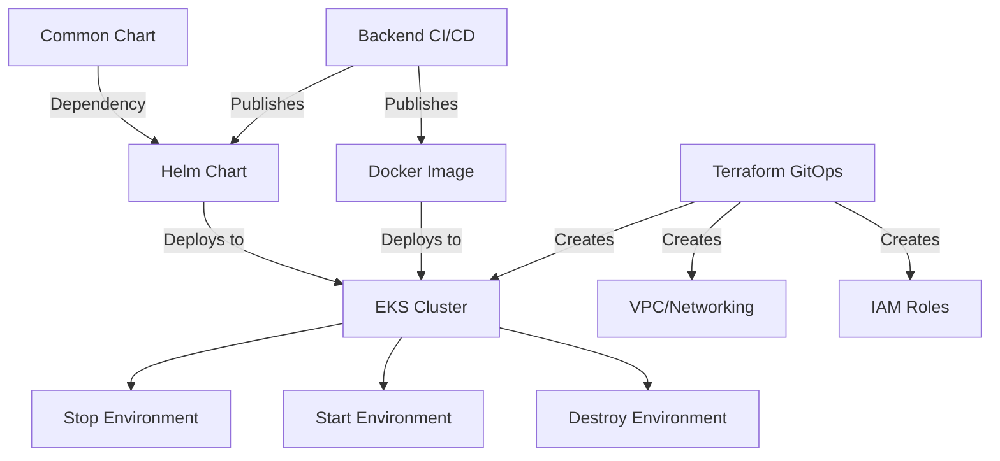

# GitHub Workflows Documentation

This directory contains GitHub Actions workflows for managing infrastructure and application deployments.

## Overview

The workflows are organized into two main categories:
1. **Infrastructure Workflows**: Terraform/Terragrunt-based infrastructure management
2. **Application Workflows**: Backend service and Helm chart CI/CD

## Available Workflows

### Infrastructure Workflows

#### 1. 🏗️ Terraform GitOps (sre-terraform-gitops.yml)

**Purpose**: Deploy and manage AWS infrastructure using Terraform and Terragrunt with a staged deployment approach.

**Trigger Methods**:
- Manual dispatch via Actions tab
- PR comments: `/terraform <action> [env] [stage]`
- Pull requests (plan only, all stages)

**Environments**: dev, qa, prod

**Deployment Stages**:
1. `all` - Deploy all stages in sequence (networking → eks-cluster → iam → eks-addons)
2. `1-networking` - VPC, subnets, NAT gateway, route tables
3. `2-eks-cluster` - EKS cluster with node groups
4. `3-iam` - IAM roles for GitHub OIDC and IRSA
5. `4-eks-addons` - EKS addons (EBS CSI driver, CoreDNS, etc.)

**Key Features**:
- Staged deployments eliminate dependency complexity
- Automatic plan on PRs affecting Terraform files
- PR comment-driven plan/apply for quick iterations
- GitHub environment protection for prod
- Plan output posted as PR comments
- Terraform state stored in S3 with DynamoDB locking

**Usage Examples**:

```bash
# Via GitHub UI: Actions → Terraform GitOps
# Select: Environment (dev/qa/prod), Action (plan/apply), Stage (all/1-4)

# Via PR comments (NEW: now supports stage specification):
/terraform plan dev                # Plan all stages in dev (default)
/terraform plan dev 1-networking   # Plan only networking stage
/terraform apply dev 3-iam         # Apply only IAM stage
/terraform apply qa all            # Apply all stages in qa (explicit)

# PR comment defaults:
# - No environment: defaults to dev
# - No stage: defaults to all
```

**Typical Deployment Flow**:
```bash
# Fresh environment deployment (4 separate runs):
1. Stage: 1-networking → Action: apply
2. Stage: 2-eks-cluster → Action: apply
3. Stage: 3-iam → Action: apply
4. Stage: 4-eks-addons → Action: apply

# Single module update:
# Stage: 3-iam → Action: plan (review changes)
# Stage: 3-iam → Action: apply (deploy changes)
```

**Important Notes**:
- Single-stage deployments use `-auto-approve` (no manual confirmation)
- All-stages deployment will ask for approval per module
- Dependencies between stages are managed by execution order, not Terragrunt mocks
- Refer to `/sre/STAGED-DEPLOYMENT.md` for detailed documentation

---

#### 2. 🗑️ Environment Destroy (sre-environment-destroy.yml)

**Purpose**: Completely tear down non-production environments (infrastructure + workloads).

**Trigger**: Manual dispatch only

**Environments**: dev, qa (prod is blocked)

**Safety Features**:
- Requires typing "destroy" to confirm
- 10-second warning delay
- Only works for non-prod environments
- Backs up Terraform state before destruction
- Validates resources are destroyed after completion

**Workflow Steps**:
1. Validate environment (reject prod)
2. Validate confirmation text
3. Back up Terraform state to S3
4. Run `terragrunt run-all destroy`
5. Verify EKS cluster and VPC are destroyed

**Usage**:
```bash
# Via GitHub UI: Actions → Destroy Environment
# Select: Environment (dev/qa)
# Confirm: Type "destroy"
```

**What Gets Destroyed**:
- EKS cluster and node groups
- VPC, subnets, NAT gateway
- IAM roles (GitHub OIDC, IRSA roles)
- EKS addons
- Security groups and route tables

**What Remains**:
- S3 Terraform state bucket (for recovery)
- State backups in `backups/<timestamp>/` prefix

---

#### 3. 🛑 Stop Environment (sre-environment-stop.yml)

**Purpose**: Scale down Kubernetes workloads to zero replicas for cost savings (infrastructure remains running).

**Trigger**: Manual dispatch

**Environments**: dev, qa, prod

**Key Features**:
- Saves current replica counts before scaling to zero
- Useful for overnight/weekend cost optimization
- Infrastructure (EKS, VPC, NAT) keeps running
- Can be reversed with Start Environment workflow

**Workflow Steps**:
1. Authenticate to AWS
2. Get EKS credentials
3. Save replica state and scale to zero
4. Verify all pods are stopped

**Usage**:
```bash
# Via GitHub UI: Actions → Stop Environment
# Select: Environment (dev/qa/prod)
```

**Cost Impact**:
- **Stopped**: EC2 instances for pods (if using HPA, pods scale to 0)
- **Still Running**: EKS control plane, NAT gateway, EC2 nodes
- **Typical Savings**: ~30-50% reduction in compute costs

---

#### 4. 🚀 Start Environment (sre-environment-start.yml)

**Purpose**: Restore Kubernetes workloads to their saved replica counts.

**Trigger**: Manual dispatch

**Environments**: dev, qa, prod

**Key Features**:
- Restores workloads to replica counts saved by Stop workflow
- Waits for pods to be ready (10-minute timeout)
- Health check after restoration
- Can selectively start specific services (or "all")

**Workflow Steps**:
1. Authenticate to AWS
2. Get EKS credentials
3. Restore workloads from saved state
4. Wait for pods to be ready
5. Perform health check

**Usage**:
```bash
# Via GitHub UI: Actions → Start Environment
# Select: Environment (dev/qa/prod)
# Services: "all" or comma-separated list
```

**Pod Readiness**:
- Workflow waits up to 10 minutes for pods to be ready
- If pods aren't ready, workflow continues but shows warning
- Check pod status in workflow output

---

### Application Workflows

#### 5. 🐳 Backend Service CI/CD (service-backend-workflow.yml)

**Purpose**: Build, test, scan, and publish the Java backend service and its Helm chart.

**Trigger Methods**:
- Push to main/master branch
- Pull requests to main/master
- Manual dispatch

**Pipeline Stages** (separate jobs for better visibility):

**Stage 1: Build and Test**
- Compile Java code with Maven (JDK 8)
- Run unit tests
- Detect branch and determine target environment
- Generate semantic version: `<base>.<build>-<sha>-<suffix>` (suffix based on branch)
- Upload JAR artifacts for Docker build

**Stage 2: Docker Build**
- Download build artifacts (JAR files)
- Build Docker image locally
  - Single platform (amd64) for PRs to enable scanning
  - Multi-platform (amd64, arm64) for deployable branches
- Output image reference for subsequent stages

**Stage 3: Security Scan** (PRs only)
- Download build artifacts
- Build single-platform Docker image (amd64) for scanning
- Scan image for vulnerabilities with Trivy
- Upload SARIF results to GitHub Security tab

**Stage 4: Publish Docker Image** (deployable branches only)
- Download build artifacts
- Build single-platform Docker image (amd64)
- Configure AWS credentials
- Publish image to ECR
- Save build metadata for CD workflow

**Stage 5: Publish Helm Chart** (deployable branches only)
- Configure AWS credentials
- Install Helm and helm-s3 plugin
- Download chart dependencies
- Package chart with Docker image version as appVersion
- Push chart to S3 repository

**Stage 6: Workflow Summary** (always runs)
- Generates comprehensive pipeline status
- Shows each stage result with numbered indicators (1️⃣-5️⃣)
- Displays version, image reference, and ECR URI
- Provides pull command for published images

**Versioning**:
```bash
# Example version generation:
Base version (pom.xml): 1.0.0-SNAPSHOT
Build number: 42
Commit SHA: abc12345

Final version: 1.0.0.42-abc12345-SNAPSHOT
```

**Pipeline Execution by Event Type**:

| Stage | Pull Request | Feature Branch | Deployable Branch (develop/release/hotfix) |
|-------|-------------|----------------|-------------------------------------------|
| 1️⃣ Build and Test | ✅ Always | ✅ Always | ✅ Always |
| 2️⃣ Docker Build | ✅ Single platform | ✅ Multi-platform | ✅ Multi-platform |
| 3️⃣ Security Scan | ✅ Yes | ❌ No | ❌ No |
| 4️⃣ Publish Docker Image | ❌ No | ❌ No | ✅ Yes |
| 5️⃣ Publish Helm Chart | ❌ No | ❌ No | ✅ Yes |
| 6️⃣ Workflow Summary | ✅ Always | ✅ Always | ✅ Always |

**Pipeline Flow Visualization**:
```
┌─────────────────────┐
│ 1️⃣ Build and Test  │
│ (Maven + JUnit)     │
└──────────┬──────────┘
           │
           ▼
┌─────────────────────┐
│ 2️⃣ Docker Build     │
│ (Multi-platform)    │
└──────┬──────────────┘
       │
       ├─────────────────────────┐
       │                         │
       ▼                         ▼
┌──────────────┐      ┌─────────────────────┐
│ 3️⃣ Security  │      │ 4️⃣ Publish Docker   │
│    Scan      │      │    Image (ECR)      │
│ (PRs only)   │      │ (Deployable only)   │
└──────────────┘      └──────────┬──────────┘
                                 │
                                 ▼
                      ┌─────────────────────┐
                      │ 5️⃣ Publish Helm     │
                      │    Chart (S3)       │
                      │ (Deployable only)   │
                      └──────────┬──────────┘
                                 │
       ┌─────────────────────────┴─────────────────────────┐
       │                                                     │
       ▼                                                     ▼
┌────────────────────────────────────────────────────────────┐
│ 6️⃣ Workflow Summary (Always runs)                         │
│ Shows status of all stages with numbered indicators       │
└────────────────────────────────────────────────────────────┘
```

**Usage**:
```bash
# Automatic on PR:
git checkout -b feature/my-change
git push origin feature/my-change
# Creates PR → Workflow runs (build, test, scan, no push)

# Automatic on merge:
git checkout main
git merge feature/my-change
git push origin main
# Workflow runs (build, test, scan, push, publish chart)
```

**Artifacts**:
- Docker image: `{account-id}.dkr.ecr.us-east-1.amazonaws.com/backend:<version>`
- Helm chart: Published to `s3://tekmetric-helm-charts-{account-id}/charts/`
- Security scan: SARIF uploaded to GitHub Security tab

---

#### 6. 📦 Common Helm Chart (sre-helm-common-chart.yml)

**Purpose**: Publish the shared `tekmetric-common-chart` library chart used as a dependency by application charts.

**Trigger Methods**:
- Push to main/master affecting `sre/helm/common/charts/tekmetric-common-chart/**`
- Manual dispatch

**Workflow Steps**:
1. Lint Helm chart
2. Get chart info (name, version, appVersion)
3. Validate chart templates with dry-run
4. Publish chart using chart-releaser
5. Generate summary with installation instructions

**Chart Repository**:
- Published to: `s3://tekmetric-helm-charts-{account-id}/charts/`
- Can be added as a Helm dependency in other charts

**Usage as Dependency**:
```yaml
# In your Chart.yaml:
dependencies:
  - name: tekmetric-common-chart
    version: "1.0.0"
    repository: "s3://tekmetric-helm-charts-{account-id}/charts/"
```

**Version Management**:
- Version is read from `Chart.yaml`
- Update `Chart.yaml` version to publish new release
- Use semantic versioning (e.g., 1.0.0, 1.1.0, 2.0.0)

---

## Workflow Patterns and Best Practices

### Authentication and Security

**AWS Authentication**:
All infrastructure workflows use OIDC-based authentication:
```yaml
- name: Assume AWS Role
  uses: ./.github/actions/aws-assume-role
  with:
    environment: dev
    role-arn: ${{ secrets.AWS_DEV_ROLE_ARN }}
    account-id: ${{ secrets.AWS_DEV_ACCOUNT_ID }}
```

**Required Secrets per Environment**:
- `AWS_<ENV>_ROLE_ARN`: IAM role ARN for GitHub Actions
- `AWS_<ENV>_ACCOUNT_ID`: AWS account ID

**Permissions**:
- Infrastructure workflows: `id-token: write` (for OIDC)
- Application workflows: `packages: write` (for GHCR), `security-events: write` (for Trivy)

### Concurrency Control

**Purpose**: Prevent multiple runs from conflicting

```yaml
concurrency:
  group: terraform-${{ inputs.environment }}-${{ inputs.stage }}
  cancel-in-progress: false  # Don't cancel infrastructure changes
```

```yaml
concurrency:
  group: backend-ci-${{ github.ref }}
  cancel-in-progress: true  # Cancel old PR builds
```

**Best Practices**:
- Infrastructure: Never cancel in-progress runs
- Application: Cancel old PR builds to save resources

### Environment Protection

**Production Safeguards**:
- GitHub Environment protection with required reviewers
- Explicit confirmation for destructive operations
- Prevent prod from being destroyed via workflow

**Setup**:
```bash
# In GitHub: Settings → Environments → prod
1. Enable "Required reviewers"
2. Add reviewers (minimum 1)
3. Enable "Wait timer" (optional)
```

### Staged vs All-at-Once Deployment

**When to Use Staged Deployment** (Terraform GitOps):
- Fresh environment setup
- Major infrastructure changes
- Troubleshooting specific module issues
- Testing changes to single module

**When to Use All-at-Once**:
- Minor updates across multiple modules
- After staged deployment is proven working
- Emergency updates that need speed

### Cost Optimization Strategy

**Development Environments**:
```bash
# Weekday: 9 AM EST
Actions → Start Environment → dev

# Weekday: 6 PM EST
Actions → Stop Environment → dev
```

**QA Environments**:
```bash
# Before test cycle
Actions → Start Environment → qa

# After test cycle completion
Actions → Stop Environment → qa
```

**Production**:
- Never stop production workloads
- Use autoscaling for cost optimization
- Consider scheduled scaling via Kubernetes HPA

---

## Troubleshooting Guide

### Terraform GitOps Issues

**Issue**: Plan shows "error asking for approval: EOF"
**Solution**: Ensure using single-stage deployment with auto-approve flag already applied

**Issue**: Mock outputs errors
**Solution**: All mocks removed - use staged deployment instead

**Issue**: Dependency errors in run-all
**Solution**: Use staged deployment (recommended). For apply operations only, you can use `--terragrunt-ignore-dependency-errors` to continue past errors, but **never use this for destroy operations** as it can cause cascading failures (e.g., trying to destroy VPC while EKS is still running)

### Backend Service Issues

**Issue**: Maven build fails
**Cause**: Usually dependency resolution or compilation errors
**Solution**: Check JDK version (must be 8), review pom.xml dependencies

**Issue**: Docker push fails with authentication error
**Solution**: Verify `packages: write` permission in workflow

**Issue**: Trivy scan fails the workflow
**Cause**: `exit-code: '1'` and vulnerabilities found
**Solution**: Set `exit-code: '0'` to not fail on vulnerabilities (report only)

### Environment Stop/Start Issues

**Issue**: Pods don't scale down
**Cause**: Deployments not in target namespace
**Solution**: Verify namespace matches workloads (default: "default")

**Issue**: Replica state not saved
**Cause**: Script error or S3 bucket not accessible
**Solution**: Check script logs, verify AWS permissions

**Issue**: Pods don't start after restore
**Cause**: Node capacity, image pull errors, PVC issues
**Solution**: Check pod events: `kubectl describe pod <pod-name>`

### Common Errors

**Error**: `Resource not found` during destroy
**Solution**: Resources already deleted or never created - usually safe to ignore

**Error**: `DependencyViolation` during VPC destroy
**Solution**: ENIs still attached - wait a few minutes or manually detach

**Error**: `Cluster not found` during start/stop
**Solution**: EKS cluster doesn't exist - run Terraform workflow first

---

## Required Secrets Configuration

### Repository Secrets

Configure these in: **Settings → Secrets and variables → Actions**

#### AWS Credentials (per environment):
```bash
AWS_DEV_ROLE_ARN=arn:aws:iam::123456789012:role/github-actions-dev
AWS_DEV_ACCOUNT_ID=123456789012

AWS_QA_ROLE_ARN=arn:aws:iam::234567890123:role/github-actions-qa
AWS_QA_ACCOUNT_ID=234567890123

AWS_PROD_ROLE_ARN=arn:aws:iam::345678901234:role/github-actions-prod
AWS_PROD_ACCOUNT_ID=345678901234
```

#### GitHub Token:
- `GITHUB_TOKEN`: Automatically provided by GitHub Actions
- Used for: GHCR push, chart publishing, PR comments

### Environment Secrets

Some secrets are scoped to specific environments for additional security:

**dev environment**:
- Inherits: `AWS_DEV_ROLE_ARN`, `AWS_DEV_ACCOUNT_ID`

**qa environment**:
- Inherits: `AWS_QA_ROLE_ARN`, `AWS_QA_ACCOUNT_ID`
- Protection: Optional reviewers

**prod environment**:
- Inherits: `AWS_PROD_ROLE_ARN`, `AWS_PROD_ACCOUNT_ID`
- Protection: Required reviewers, wait timer

---

## Workflow Dependencies



---

## Monitoring and Observability

### Workflow Run Status

**View in GitHub**:
- Navigate to **Actions** tab
- Select workflow from left sidebar
- View run history, duration, and status

### Step Summaries

All workflows generate rich summaries visible in:
- Workflow run page (summary tab)
- PR comments (for Terraform plans)

**Summary Contents**:
- Job status table
- Resource information
- Commands to use artifacts
- Links to AWS console

### Notifications

**Configure in**: Settings → Notifications → Actions

**Recommended Settings**:
- ✅ Notify on workflow failure
- ✅ Notify on workflow success (prod only)
- ❌ Don't notify on cancelled runs

### Logs and Artifacts

**Logs Retention**: 90 days (GitHub default)

**Artifacts**:
- Terraform plans: 5 days
- Terraform apply outputs: 30 days
- Trivy scan results: 30 days

---

## Quick Reference

### Common Commands

```bash
# Plan infrastructure changes
/terraform plan dev

# Apply infrastructure changes
/terraform apply dev

# Stop dev environment
Actions → Stop Environment → dev

# Start dev environment
Actions → Start Environment → dev

# Destroy dev environment
Actions → Destroy Environment → dev → confirm: "destroy"

# Build backend PR
git push origin feature/my-change  # Automatic on PR

# Deploy backend to prod
git merge feature/my-change
git push origin main  # Automatic on push
```

### Resource Links

- [Custom Actions Documentation](../actions/README.md)
- [Staged Deployment Guide](/sre/STAGED-DEPLOYMENT.md)
- [EKS Admin Access Guide](/sre/terraform/modules/eks/README.md)
- [GitHub Actions Documentation](https://docs.github.com/en/actions)
- [Terragrunt Documentation](https://terragrunt.gruntwork.io/)

---

## Contributing

When modifying workflows:

1. **Test in feature branch first**
   ```bash
   git checkout -b workflow/update-terraform
   # Modify workflow
   git push origin workflow/update-terraform
   # Create PR and test
   ```

2. **Update documentation**
   - Update this README with changes
   - Update inline comments in workflow YAML
   - Document breaking changes

3. **Version pin actions**
   ```yaml
   # Good
   uses: actions/checkout@v4
   uses: hashicorp/setup-terraform@v3

   # Bad
   uses: actions/checkout@main
   ```

4. **Follow naming conventions**
   - Workflows: `<category>-<purpose>.yml`
   - Jobs: Use descriptive names
   - Steps: Use emojis for quick scanning

5. **Add appropriate permissions**
   ```yaml
   permissions:
     contents: read      # Always minimal
     id-token: write    # Only if using OIDC
     packages: write    # Only if pushing images
   ```

---

## Changelog

### 2025-12-11 - Documentation and PR Comment Enhancement
- Created comprehensive workflows documentation
- Updated actions README with all 6 custom actions
- Removed redundant USAGE_GUIDE.md
- Documented staged deployment approach for Terraform GitOps
- **Enhanced PR comments to support stage specification** (`/terraform plan dev 1-networking`)
- Added troubleshooting guide and quick reference

### 2025-12-10 - Staged Deployment Implementation
- Added staged deployment support to Terraform GitOps workflow
- Removed all mock outputs complexity
- Added auto-approve for single-stage deployments
- Fixed EOF error for single-stage applies

### 2025-12-09 - EKS Access Management
- Implemented IAM Role + Group pattern for EKS admin access
- Updated EKS authentication mode to API_AND_CONFIG_MAP
- Added IRSA support for EKS addons
- Fixed EBS CSI driver conditional installation

### 2025-12-08 - Infrastructure Workflows
- Created Terraform GitOps workflow with PR comment support
- Created backend service CI/CD workflow
- Created environment lifecycle workflows (stop/start/destroy)
- Created common Helm chart workflow
- Implemented custom composite actions for reusability
